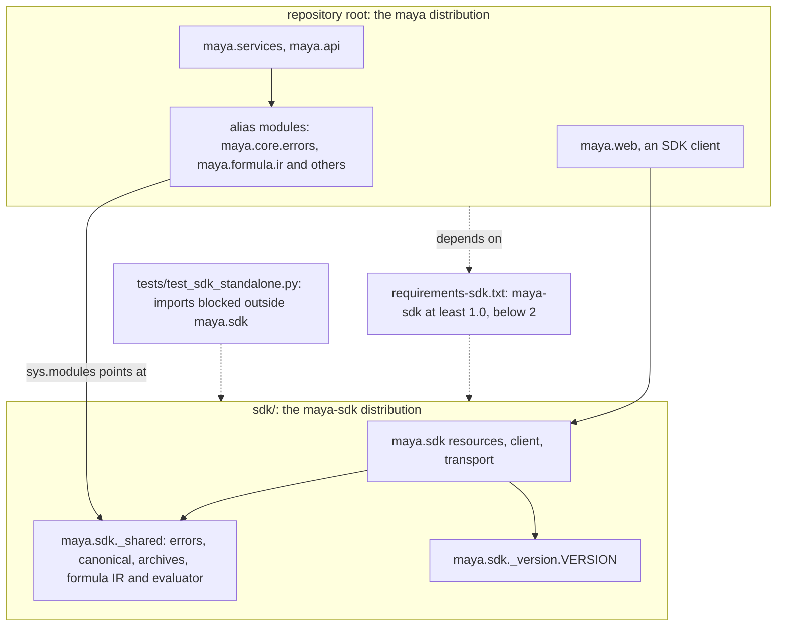

# Developing the SDK

This page is for a developer changing `maya-sdk`, the Python client — the project in `sdk/` — whether adding a method for a new endpoint, moving code the server and the client must share, or cutting a release. The SDK is its own distribution: end users install it without the server, and the server depends on it like any other client. Most of what is particular about working on it follows from that. How the SDK is structured is in [the architecture page on the SDK](../architecture/sdk.md); what a user sees — connecting, profiles, errors, record and replay, offline bundles, every namespace — is in the [SDK and CLI reference](../../maya/web/guides/sdk-cli-reference.md) and in [sdk/README.md](../../sdk/README.md). Adding a method for a new endpoint is covered end to end in [api-endpoints.md](api-endpoints.md).

## When you would do this, and what you touch

| File | Why |
|---|---|
| `sdk/maya/sdk/resources.py`, `governance.py`, `integrations.py`, `llm.py` | resource classes and their `@endpoint` methods |
| `sdk/maya/sdk/client.py` | `Client`, `AsyncClient`, `connect()`, profile reading, the namespace binding |
| `sdk/maya/sdk/_shared/` | code the server and the SDK must share exactly |
| `maya/core/errors.py`, `canonical.py`, `archives.py`, `maya/formula/ir.py`, `evaluate.py`, `composite.py` | the server's alias modules for `_shared` |
| `sdk/maya/sdk/_version.py` | the SDK's own version |
| `sdk/pyproject.toml` | dependencies and extras of `maya-sdk` |
| `requirements-sdk.txt` | the range of `maya-sdk` versions the server accepts |
| `tools/ci/public_symbols.lock.json` | the SDK's public surface, regenerated on purpose |

## How the two projects relate



`maya` is a **namespace package**: neither project has a `maya/__init__.py`, so `maya.sdk` from one distribution and `maya.core`, `maya.services` and the rest from the other install side by side under one name. In a checkout, `pip install -e ./sdk` makes `maya.sdk` importable, and `pytest.ini` puts both `.` and `sdk` on the path. The server's `pyproject.toml` excludes `maya.sdk*` from its own packages, so the server wheel carries no copy of the client.

## What the SDK may import

**Nothing from MAYA outside `maya.sdk`.** Not `maya.core`, not `maya.formula`, not `maya_delta`. The SDK's dependencies are `httpx`, `PyYAML`, `pyarrow` and `numpy`, plus the extras `offline` (`cryptography`, to check a bundle's signature) and `polars`. An optional dependency is imported where it is used and its absence is reported, not crashed on: `maya.sdk.offline` verifies file hashes without `cryptography` and says the signature was not checked. `tools/ci/seam_imports.py` already lists `maya.sdk.offline` among the modules allowed to import `cryptography`.

No static gate enforces the rule — the import-boundary gate is about `maya.web` and `maya.persistence` — so the test does. `tests/test_sdk_standalone.py` starts a fresh interpreter whose import system raises for any `maya.*` module outside `maya.sdk`, imports every SDK module, and uses what an end user uses: a client, a YAML profile with a placeholder, a server error mapped to its class, canonical hashing, an offline bundle opened, verified and scored. It then builds the `maya-sdk` wheel, unpacks it where nothing else of MAYA exists, and does it all again; and it builds the server wheel and asserts it contains no `maya/sdk/` and declares `Requires-Dist: maya-sdk`.

This is also why the SDK reads its own profile file, `~/.maya/config.yaml`, in the same `${VAR:default}` dialect as the server's configuration but with its own small reader: the server's configurator is not available to it.

## Code the two sides share: `_shared`

A few things must behave identically on both sides. The error hierarchy, so a refusal the server raises is the class the client raises. Canonical content hashing, so a pin's hash matches wherever it is computed. Archive reading, so a bundle is opened the same way. The formula IR and its evaluator, so a bundle scores offline exactly as MAYA scores it. These live once, in `maya.sdk._shared`, and the server's old module names are aliases — the same module object, not a copy:

```python
# maya/core/errors.py
import sys
from typing import TYPE_CHECKING

from maya.sdk._shared import errors as _shared

if TYPE_CHECKING:  # what this name is, for the type checker
    from maya.sdk._shared.errors import *  # noqa: F403

sys.modules[__name__] = _shared
```

Replacing the entry in `sys.modules` means `import maya.core.errors` and `from maya.core.errors import NotFound` give the shared module, private names and all, so none of the server's existing imports had to change. The `TYPE_CHECKING` import tells mypy what the name is.

**Moving server code into `_shared`** is the same three steps each time:

1. move the module into `sdk/maya/sdk/_shared/`, and make it import only from `maya.sdk` and the SDK's dependencies — anything it needed from the server must come with it or be cut;
2. replace the server module with an alias exactly like the one above;
3. run `tests/test_sdk_standalone.py`, which fails if the moved code still reaches back.

Move code into `_shared` only when the client genuinely needs identical behaviour. Everything in it becomes part of what the SDK must keep working without the server, and part of what a server change can break in every client.

**Error classes** deserve a note of their own: the SDK maps a problem document's `type` to a class through `ERRORS_BY_CODE` in `_shared/errors.py`. A new error a client should be able to catch by name is added there, with its `code` and HTTP `status`, and exported from `maya.sdk.__init__` if users are meant to import it.

## Versions and compatibility

The SDK's version is its own:

```python
# sdk/maya/sdk/_version.py
VERSION = "1.0.0"
```

It is read by `sdk/pyproject.toml` for the distribution and sent on every request as `X-Maya-Client: python/<version>`. The server refuses a client older than `MIN_CLIENT` (in `maya/api/app.py`) with `426 client_too_old`. `tools/ci/version_single_source.py` allows the version string in exactly two files: `maya/core/version.py`, the server's, and this one.

When to bump what:

| Change | SDK version | Also |
|---|---|---|
| a new method or namespace | minor | `public_symbols.py --update` |
| a changed signature, or a removed method | major | `requirements-sdk.txt`'s upper bound in the server; `MIN_CLIENT` if old clients would now misbehave |
| a fix with no surface change | patch | nothing |

The public-symbols lock records every name in `maya.sdk.__all__` and every public method of `Client`, `AsyncClient` and each namespace, with its signature. A difference fails the gate until it is recorded on purpose, because a removed or changed symbol breaks someone's code; the lock's diff in review is where that is seen.

## Building the wheel

```bash
python -m pip wheel ./sdk --no-deps -w dist
```

`tests/test_sdk_standalone.py` builds it the same way, with `--no-build-isolation`, after deleting `sdk/build/` so nothing stale rides along. A wheel that contains anything but `maya/sdk/…` fails that test, as does one that carries `maya/__init__.py`, which would stop it installing beside the server.

## How to test it

The SDK is tested against a real server, in process, with no network:

- `maya.testing.Maya` gives an in-process `Client` per seeded user: the whole server runs, and the SDK's transport talks to it through the ASGI app. Use it for anything a method does end to end.
- `tests/test_sdk_modes.py` holds record and replay — a cassette replays with no server, a refusal replays as the same typed error, a cassette never holds a credential, the async client shares cassettes with the sync one — and the offline bundle tests.
- `tests/test_sdk_handles.py` holds the convenience layer: records that read like objects, pins that become tables, the pin cache verified by content hash.
- `tests/test_sdk_standalone.py` holds the independence described above. It builds wheels, so it is slower than the rest; run it whenever you touch imports in `sdk/` or `_shared`.

```bash
.venv/bin/python -m pytest tests/test_sdk_standalone.py tests/test_sdk_modes.py \
    tests/test_sdk_handles.py tests/test_cli.py -q
.venv/bin/python tools/ci/sdk_parity.py && .venv/bin/python tools/ci/public_symbols.py
```

Gates that cover `sdk/`: `lint.py`, `cycle_check.py`, `module_symbols.py`, `file_size.py` (`resources.py` is close to its 1,500-line limit, which is why newer namespaces live in `governance.py`, `integrations.py` and `llm.py`, sharing the base in `base.py`), `sast.py`, `version_single_source.py`, `public_symbols.py` and `sdk_parity.py`. `typecheck.py` checks `maya/services` only; `mypy_path` in `pyproject.toml` includes `sdk` so the services' imports of `maya.sdk._shared` resolve.

## Common mistakes

- **Importing a server module "just for a helper".** The standalone test fails, and so does every user's install.
- **Copying server code into the SDK instead of moving it to `_shared`.** Two copies drift, and a hash or an error code silently stops matching.
- **Making `_shared` depend on something the SDK does not declare.** Add it to `sdk/pyproject.toml`, or keep the code on the server.
- **Changing a signature without a major version**, or without the server's range in `requirements-sdk.txt`.
- **Adding `maya/__init__.py`** to either project. It breaks the namespace package, and one distribution then hides the other.
- **Editing `sdk/build/`.** It is a build output; the test deletes it.
