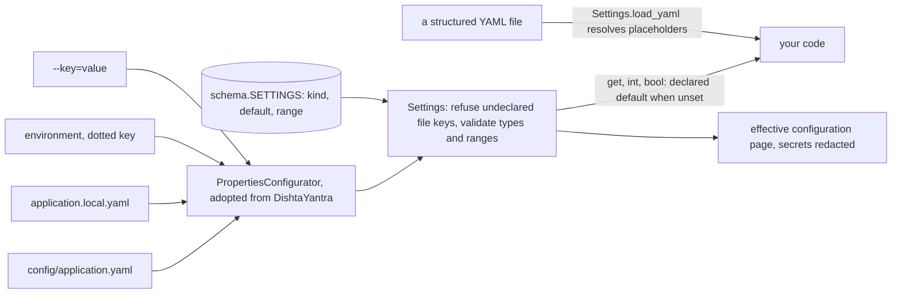

# Adding a setting, and adding a configuration file

This page is for a developer whose change needs something configurable — a limit, a path, a switch — or a structured file of its own beside `config/application.yaml`. How a deployment sets a value (the layers, placeholders, the local overlay, the environment, the command line) is user-facing and is in the [configuration reference](../../maya/web/guides/configuration-reference.md#how-settings-are-resolved); this page is about the code side: declaring, reading, documenting and testing. Where configuration sits in the running platform is in [the architecture overview](../architecture/README.md).

The design rule the rest of the page follows: **a setting's default lives in one place**, `maya/config/schema.py`. Before the schema existed, a setting was whatever `settings.get(key, default)` happened to say at the call site, so the tracked file, the documentation and the code drifted apart without anything noticing, and a typo in the file was a key nobody read. Now an undeclared key in a configuration file stops startup, naming the nearest declared key — `db.dialct` stops MAYA instead of silently leaving SQLite in place — and a test compares every default written in the code with the schema's.

## When you would do this, and what you touch

| File | For a setting | For a structured file |
|---|---|---|
| `maya/config/schema.py` | the declaration: key, kind, description, default, range | a setting that names the file's path |
| the code that reads it | `settings.get/int/bool(key, default)` | `settings.load_yaml(path)` and your own validation |
| `maya/web/guides/configuration-reference.md` | a row in the key's section | the file's format, or a link to where it is described |
| `config/application.yaml` | only if a deployment usually changes it; never a secret | — |
| `config/<name>.example.yaml` | — | an example a deployment copies, as `llm_profiles.example.yaml` is |
| `tests/` | a test that reads the setting through the real loader | a test of placeholders and refusals |

## How a value reaches code



## Adding a setting

The worked example is `sources.landing.roots`, the folders a `landing` source may read, from the [connector guide](source-connectors.md#2-write-the-reader).

### 1. Declare it

Every setting is a `Setting` in `SETTINGS`. The nearest relative of the example, as it stands:

```python
# maya/config/schema.py
    _s(
        "sources.delta.roots",
        "string",
        "Directories a `delta` feature source may read, separated by the path separator. "
        "Empty means the lake root alone.",
        "",
    ),
```

```python
# maya/config/schema.py: the new declaration (example)
    _s(
        "sources.landing.roots",
        "string",
        "Folders a `landing` feature source may read, separated by the path separator. "
        "Empty means landing sources read nothing.",
        "",
    ),
```

What each field buys:

- **`kind`** is one of `string`, `int`, `float`, `bool`, `path`, `choice`, `list`, `duration`. A value of the wrong kind refuses startup, naming the key and what it accepts. A `path` that is relative is anchored at the project root — not the working directory, because a relative path that means a different estate depending on where somebody launched a script is the wrong kind of surprise for a store of record. `choice` needs `choices=`; `int`, `float` and `duration` take `minimum=` and `maximum=`.
- **`description`** is shown on the effective-configuration page and in the startup refusal; it must end with a full stop or a closing parenthesis (`tests/test_config_schema.py` checks). Say what the setting does and what its empty value means.
- **`default`** is the only default. Leave it `None` only for a setting that has none.
- **`required=True`** refuses startup when the setting has no value. Four settings are required; adding a fifth breaks every existing deployment's configuration, so it needs a reason that outweighs that.
- **`secret=True`** redacts the value on the effective-configuration page. A key whose name contains `password`, `secret` or `token` is redacted regardless.

### 2. Read it

```python
# reading the new setting (example)
raw = settings.get("sources.landing.roots", "") or ""
```

Write the call-site default as the declared one, or leave it out. `Settings.get` returns the schema's default for an unset declared key in any case, so a different literal at the call site is never used — it is only misleading, and `tests/test_config_schema.py::test_no_call_site_invents_a_default_the_schema_does_not_declare` fails on it. That test finds calls by walking the source for `get`, `int`, `bool` (and the configurator's accessors) on a receiver called `settings`, `props`, `s` or `cfg`, or an attribute of that name such as `self.p.settings`. A setting read through a variable with another name is invisible to it, which is a reason to keep the names, not a loophole.

Read settings where they are used, at the time they are used, rather than copying them into module globals at import: tests build platforms with different settings in one process (`build_platform(["--key=value"])`), and a value captured at import belongs to whichever platform happened to come first.

### 3. Document it

Add a row to the key's section of the configuration reference, in the same form as its neighbours. Two tests hold that page to the schema: `tests/test_help_accuracy.py::test_the_configuration_reference_covers_every_setting` fails while a declared key is missing from it, and `test_every_default_the_help_states_is_the_real_default` fails if a default written in parentheses after a key differs from the schema's. The page is user-facing, so this is where the rule a deployment needs is written — not here.

### 4. The tracked file, if at all

`config/application.yaml` does not need every setting; the schema supplies defaults. Add a key there only when a deployment usually changes it, and then as a placeholder with the declared default (`"${MAYA_LANDING_ROOTS:}"`) so it can be set from the environment. The file is tracked and carries no secret: `tools/ci/no_secrets.py` fails if a key ending in `password`, `secret`, `token`, `api_key` or `private_key` holds anything but an empty `${VAR:}` reference. A secret's *name* goes in configuration — `password_env`, `api_key_env` — and the secret in the environment.

## Adding a structured configuration file

Some configuration is a document, not a key: the model profiles (`llm.profiles_file`), the tiering questionnaire (`governance.tiering_questionnaire`), the shipped workflow policies. Such a file is YAML read through the same configurator, with `Settings.load_yaml`, so its `${VAR:default}` placeholders resolve with the same precedence as every setting:

```python
# maya/config/__init__.py
    def load_yaml(self, path: str | Path) -> Any:
        """A structured YAML configuration file -- model profiles, the tiering
        questionnaire, workflow policies -- read through the configurator, as DishtaYantra
        reads its structured files: ``${VAR:default}`` placeholders are resolved with the
        same precedence as every setting (command line, environment, files), then the text
        is parsed. A relative path is resolved against the project root."""
```

A parse error comes back as `ConfigurationError` naming the file. A missing file is **not** converted: it raises `FileNotFoundError`, so decide what absence means before you call it. The model profiles treat an absent file as "one profile, made from the `llm.*` settings"; the tiering questionnaire treats an unreadable one as a refusal naming the setting.

The pattern, with a `vendor_feeds` file as the example — a list of the vendors whose landing folders a firm expects, with a contact for each:

```python
# a structured configuration file and its loader (example)
FEED_KEYS = {"folder", "contact", "cutoff"}


def vendor_feeds(settings: Any, path: str | Path) -> dict[str, dict[str, str]]:
    """Every vendor feed in the file, checked; an absent file means no feeds."""
    from maya.config import project_root

    file = Path(path) if Path(path).is_absolute() else project_root() / path
    if not file.exists():
        return {}
    doc = settings.load_yaml(file) or {}
    feeds = {}
    for name, raw in (doc.get("feeds") or {}).items():
        unknown = set(raw or {}) - FEED_KEYS
        if unknown:
            raise ValidationFailed(
                f"Feed '{name}' in {file} has unknown key(s) {sorted(unknown)}; "
                f"a feed takes {sorted(FEED_KEYS)}"
            )
        if not (raw or {}).get("folder"):
            raise ValidationFailed(f"Feed '{name}' in {file} names no folder")
        feeds[str(name)] = {k: str(v) for k, v in raw.items()}
    return feeds
```

```yaml
# config/vendor_feeds.yaml (example)
feeds:
  vendor_x:
    folder: vendor_x/prices
    contact: "${VENDOR_X_CONTACT:data-desk@vendor-x.example}"
    cutoff: "18:00"
```

Three habits the shipped loaders share, each for a reason:

- **Refuse unknown keys, naming them and what is accepted.** The same reason the schema refuses undeclared settings: a misspelt key that silently does nothing is how a deployment comes to believe it configured something it did not. `maya.llm.profiles._profile` is the model.
- **Anchor a relative path at the project root yourself.** A path from a configuration file is anchored when settings load, but a schema default is not, and read against the working directory it goes missing whenever a script is run from its own folder. `GovernanceService.questionnaire` says so in a comment, having been caught by it.
- **Cache by modification time if the file is read often**, as the questionnaire does — keyed on the path and `st_mtime`, so an edit takes effect without a restart and an unchanged file is not re-parsed per request.

Name the file in a setting of kind `path` (`sources.landing.vendors_file`, say, defaulting to `config/vendor_feeds.yaml`), so a deployment can move it; ship a `config/vendor_feeds.example.yaml` if the real one is per-deployment. The SDK's own profile file, `~/.maya/config.yaml`, follows the same placeholder dialect but is read by the SDK itself, because the SDK must stand without the server ([sdk-development.md](sdk-development.md)).

## How to test it

For a setting, build a platform with it and assert behaviour, not the value: `build_platform([f"--sources.landing.roots={root}"])` in `tests/conftest.py` puts the flag on the command-line layer. To test loading itself, imitate `tests/test_config_schema.py`, whose `_settings` helper writes a minimal file and loads it with nothing else in the layers; reset the configurator afterwards (`PropertiesConfigurator.reset_instance()`), since it is a process-wide singleton.

For a structured file, imitate `tests/test_structured_config.py`: write the file, set an environment variable with `monkeypatch.setenv`, and assert the placeholder resolved; then write a bad key and assert the refusal names it; then malformed YAML and assert a `ConfigurationError` naming the file. The `vendor_feeds` loader above passed exactly those tests.

```bash
.venv/bin/python -m pytest tests/test_config_schema.py tests/test_structured_config.py \
    tests/test_help_accuracy.py -q
.venv/bin/python tools/ci/no_secrets.py
```

## Common mistakes

- **A call-site default that differs from the schema's.** It is never used, and the schema test fails.
- **Declaring a key and not documenting it.** The configuration reference test fails, and a deployment cannot find it.
- **A secret in `application.yaml`.** Name the environment variable instead.
- **Reading a structured file with `yaml.safe_load`.** Placeholders then stay literal strings; use `Settings.load_yaml`.
- **Treating `FileNotFoundError` as a parse error.** Decide what an absent file means.
- **Capturing a setting at import time.**
