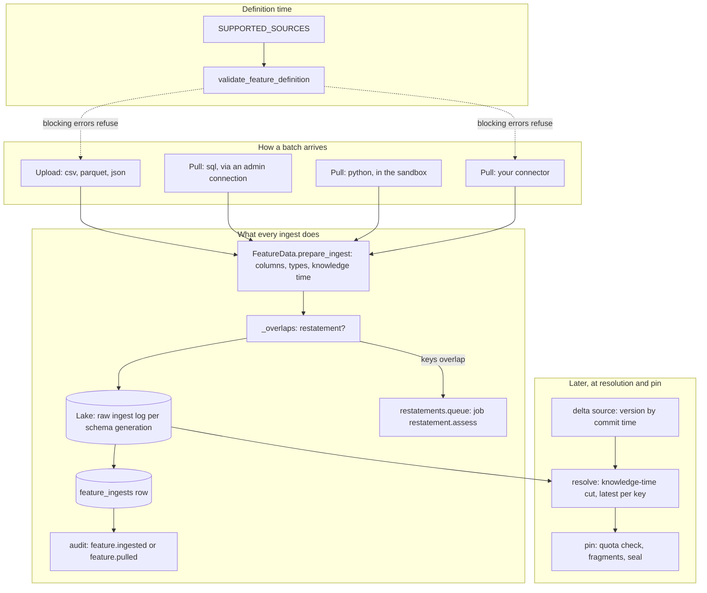
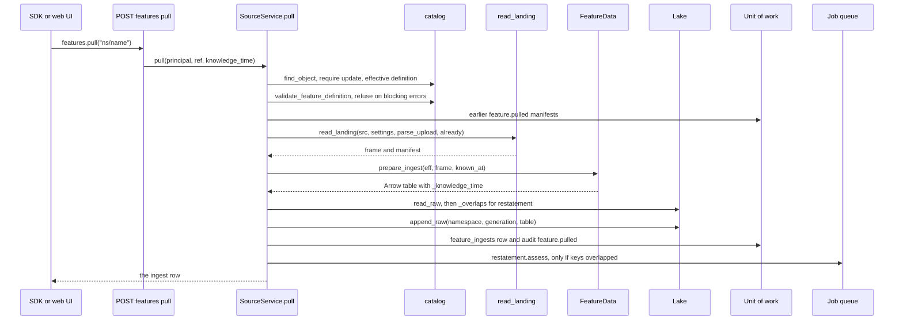

# Source connectors: the connector developer guide

This page is for a developer who needs feature data to reach MAYA from somewhere it does not reach today — a vendor's file drop, a database MAYA has no driver for, an internal service. It explains how data gets in now, the one contract every path meets, and then adds a new source type end to end with a worked example that was run against the code. What a feature designer writes in a definition — the source types, their keys, the knowledge-time column — is in the [features reference](../../maya/web/guides/features-reference.md#sources), and how the ingest log and the lake behave is in [Data, pins and the lake](../../maya/web/guides/data-and-lake-guide.md); this page does not repeat either. The architecture is in [lake and storage](../architecture/lake-and-storage.md) and [resolution](../architecture/resolution.md).

A source type is **not** a plugin today. The `source_driver` extension point lists the source types, but nothing consults it for a third-party implementation ([extension-points.md](extension-points.md#what-the-registry-does-not-reach)), so a new connector is a change to MAYA's own code. It is a small one if it follows the shape below.

## How feature data gets in

There are four paths, and which one a source takes is decided by `source.type`:

| Path | Source types | Started by | Code |
|---|---|---|---|
| **Upload** | `csv`, `parquet`, `json` | a person or script sending bytes: `POST /features/{namespace}/{name}/ingest` | `FeatureService.ingest` |
| **Pull** | `sql`, `python` | `POST /features/{namespace}/{name}/pull`; MAYA runs the reviewed query or producer | `SourceService.pull` |
| **Read-through** | `delta` | every resolution; the version read is chosen by knowledge time | `FeatureData.delta_frame` |
| **Derived** | `derived` | every resolution; rows come from other features through the algebra | `maya.resolution.algebra` |

The first two land rows in the feature's **bitemporal ingest log**, an append-only lake table, each batch stamped with a knowledge time. The pull exists, rather than reading a database live at every resolution, for the reason `maya/services/sources.py` gives in its docstring: reading the source live would absorb upstream restatements silently — the one thing bitemporality exists to prevent. `delta` is the exception that proves the rule: it is read live only because a Delta table is itself versioned, so MAYA can read the version that was committed by the knowledge cutoff and stamp each row with its commit time.

**A new connector should almost always be a pull.** It inherits the restatement handling, the audit entry and reproducibility from the log; a read-through connector has to reproduce them itself and can do so only if its source keeps history with trustworthy timestamps.

## The architecture



### The contract every ingest meets

Whatever reads the bytes, a batch becomes a frame of the definition's index and schema columns, and then goes through `prepare_ingest`:

```python
# maya/services/feature_data.py
    def prepare_ingest(
        self, eff: dict[str, Any], frame: pd.DataFrame, knowledge_time: dt.datetime
    ) -> pa.Table:
        """Validate and type an upload against the definition; stamp knowledge time."""
        cols = [a["name"] for a in full_schema(eff)]
        missing = [c for c in cols if c not in frame.columns]
        if missing:
            raise ValidationFailed(
                f"The upload is missing column(s): {', '.join(missing)}",
                missing=missing,
                found=list(frame.columns),
            )
        kcol = (eff.get("source") or {}).get("knowledge_time_column")
```

That gives a connector four things for free, and they are the reason not to write rows to the lake any other way:

- **Columns and types.** Missing columns are refused by name; values are cast to the declared logical types. Extra columns are dropped.
- **Knowledge time.** The source's own `knowledge_time_column`, when the definition names one, else the instant passed in — the moment of the pull. A connector must not invent a better-sounding time: a file's modification time is not evidence of when a vendor published it (a copy resets it), and stamping a value as known earlier than it was is exactly what the leakage certificate exists to catch.
- **Schema generation.** Raw tables are keyed by a hash of the schema, so an additive schema change starts a fresh log instead of mixing shapes.
- **A parquet-safe Arrow table**, which `lake.append_raw` writes.

Restatement detection compares values, not just keys: a batch restates something when a key already in the log comes back with a value different from the latest known one.

```python
# maya/services/features.py
    if "_knowledge_time" in old.columns:  # the latest known value of each key
        old = old.sort_values("_knowledge_time", kind="stable").drop_duplicates(index, keep="last")
# ...
    return bool(any((both[f"{c}_was"] != both[f"{c}_now"]).any() for c in values))
```

A restating batch is flagged on the `feature_ingests` row, and a `restatement.assess` job is queued in the same transaction to check live execution warrants. A connector that re-reads unchanged data appends knowledge but restates nothing, so it raises no alert; skipping files already read (as the worked example below does) still saves the work.

**Quotas are not checked at ingest.** A namespace's `quota_bytes` is enforced when a pin is requested and again before its bytes are written (`maya/services/quota.py`), because what is charged is stored pin fragments, not raw log rows. What bounds an upload is the request body limit, `api.limits.max_body_bytes`. A pull is bounded by nothing but the source; if yours can return an unbounded amount, cap it in the connector.

## Step by step: a new source type

The worked example is a **landing** source: files a vendor drops into a folder — the commonest delivery arrangement there is — read into the ingest log on demand. Its definition:

```json
{"type": "landing", "path": "vendor_x/prices", "pattern": "*.csv",
 "format": "csv", "knowledge_time_column": "published_at"}
```

`path` is relative to a landing root an administrator configures, never an arbitrary server path. All of the code below was run, by monkeypatching it into a test platform, against MAYA as it is.

### 1. Declare the type and validate the definition

`SUPPORTED_SOURCES` is the list the definition validator, the plugin registry and Admin → Extensions all read:

```python
# maya/services/catalog.py
SUPPORTED_SOURCES = ("csv", "parquet", "json", "sql", "python", "delta", "derived")
```

Add `"landing"`, then give it a branch in `validate_feature_definition` beside the existing ones:

```python
# maya/services/catalog.py
    elif src == "python":
        from maya.services.sources import validate_python_source

        errors += validate_python_source(d.get("source") or {})
```

```python
# the new branch in validate_feature_definition (example)
    elif src == "landing":
        from maya.services.sources import validate_landing_source

        errors += validate_landing_source(d.get("source") or {})
```

The validator runs at definition time and again as the `definition_valid` check on submit and approve, so everything you can refuse without reading data belongs here — a refusal at review costs nothing, a refusal at the first pull costs a release cycle.

```python
# maya/services/sources.py: validation for the new source type (example)
LANDING_FORMATS = ("csv", "parquet", "json")


def validate_landing_source(src: dict[str, Any]) -> list[str]:
    """What review refuses in a landing source, before anything is read."""
    errors = []
    folder = str(src.get("path") or "")
    if not folder:
        errors.append("a landing source names its folder in source.path")
    elif Path(folder).is_absolute() or ".." in Path(folder).parts:
        errors.append("source.path is relative to a landing root and may not contain '..'")
    if src.get("format", "csv") not in LANDING_FORMATS:
        errors.append(f"source.format must be one of {', '.join(LANDING_FORMATS)}")
    if any(sep in str(src.get("pattern") or "*") for sep in ("/", "\\")):
        errors.append("source.pattern matches file names inside the folder, not paths")
    return errors
```

### 2. Write the reader

The reader's only job is bytes to frame. Parsing goes through `FeatureData.parse_upload`, so a landing CSV is read exactly as an uploaded one, options and all. It returns a **manifest** — each file's name and SHA-256 — because the audit entry should say what was read, and because the manifest is how the next pull knows what not to read again.

```python
# maya/services/sources.py: the reader (example; also import os, Path, Collection, pandas)
def read_landing(
    src: dict[str, Any],
    settings: Any,
    parse: Callable[..., pd.DataFrame],
    already: Collection[str] = (),
) -> tuple[pd.DataFrame, dict[str, Any]]:
    """The matching files not read before, parsed and stacked, with a manifest of them."""
    roots = [
        Path(r).resolve()
        for r in (settings.get("sources.landing.roots", "") or "").split(os.pathsep)
        if r.strip()
    ]
    if not roots:
        raise ValidationFailed(
            "No landing root is configured (sources.landing.roots), so a landing source "
            "reads nothing"
        )
    folder = next(
        (
            (root / src["path"]).resolve()
            for root in roots
            if root in (root / src["path"]).resolve().parents
            and (root / src["path"]).resolve().is_dir()
        ),
        None,
    )
    if folder is None:
        raise ValidationFailed(
            f"There is no folder '{src['path']}' inside the landing roots", path=src["path"]
        )
    files = sorted(p for p in folder.glob(src.get("pattern") or "*") if p.is_file())
    if not files:
        raise ValidationFailed(f"No file in '{src['path']}' matches '{src.get('pattern') or '*'}'")
    fmt = src.get("format", "csv")
    frames, manifest = [], []
    for path in files:
        data = path.read_bytes()
        entry = f"{path.name} {hashlib.sha256(data).hexdigest()}"
        if entry in already:
            continue  # these exact bytes are in the log already
        frames.append(parse(data, fmt, src.get("options")))
        manifest.append(entry)
    if not frames:
        raise ValidationFailed(f"Nothing in '{src['path']}' is new since the last pull")
    origin = {"folder": src["path"], "files": len(frames), "manifest": manifest}
    return pd.concat(frames, ignore_index=True), origin
```

The root confinement copies `FeatureData.delta_path`, which exists so that a definition cannot name an arbitrary directory on the server. Skipping files already read matters because of `_overlaps`: without it, the second pull of an unchanged folder re-appends every row and is flagged as a restatement. A changed file has a new hash and *is* read again, and if its keys overlap that is correctly a restatement.

The reader reads `sources.landing.roots`, a new setting. It must be declared in `maya/config/schema.py` with the default the code uses (`""`) and documented in the configuration reference; [settings-and-config.md](settings-and-config.md) covers both, and two tests fail until you do.

### 3. Branch in the pull

`SourceService.pull` already does everything after the frame exists — knowledge time, restatement detection, the lake append, the `feature_ingests` row, the `feature.pulled` audit entry with a hash of what ran, and the restatement job. A new pulled source adds a branch, not a pipeline. Today the gate and the branch read:

```python
# maya/services/sources.py
            if src.get("type") not in ("sql", "python"):
                raise ValidationFailed("Only a feature whose source is 'sql' or 'python' is pulled")
# ...
        if conn is not None:
            frame = external.read_query(
                conn["url"], conn["password_env"], src["query"], bind_params(src.get("params"))
            )
            code = src["query"]
            origin = {"connection": conn["name"]}
            note = f"connection '{conn['name']}'"
```

Widen the gate to `("sql", "python", "landing")`, and add an `elif` before the python `else`:

```python
# the new branch in SourceService.pull (example)
        elif src["type"] == "landing":
            with self.p.uow() as uow:
                already = {
                    line
                    for e in uow.repo("audit_events").list(
                        action="feature.pulled",
                        object_ref=refs.object_ref("feature", ns["name"], feature["name"]),
                    )
                    for line in (e["detail"] or {}).get("manifest") or []
                }
            frame, origin = read_landing(
                src, self.p.settings, self.p.feature_data.parse_upload, already
            )
            code = "\n".join(origin["manifest"])  # what was read, hashed for the audit entry
            note = f"{origin['files']} file(s) from landing folder '{src['path']}'"
```

`origin` is spread into the audit detail, so the manifest is recorded with every pull and read back by the next. Reading prior audit entries as state is the cheapest correct choice for an example; a connector that will see thousands of files should keep its own table instead ([persistence-and-schema.md](persistence-and-schema.md) adds one as its worked example).

### 4. The rest of the surface

| Where | What changes | Why |
|---|---|---|
| `maya/web/templates/workbench/_feature_fields.html` | add `landing` to the source-type list, and fields for `path`, `pattern`, `format` | the feature designer builds the definition from these |
| `maya/web/routes/workbench.py`, `_source_from_form` | read those fields into `source` | otherwise the designer saves a landing source without its path |
| `maya/services/catalog.py`, `source_text` | a `landing` branch | otherwise a diff describes it as "landing upload (…)" |
| `maya/api/routers/catalog.py`, `pull_feature` | the docstring, if your source is pulled rather than uploaded ("sql- or python-sourced") | it is the API reference's text |
| plugin registry, Admin → Extensions | nothing | `built_ins` reads `SUPPORTED_SOURCES` |
| REST API and SDK | nothing | `POST …/pull` and `features.pull()` already exist, so the API snapshot and SDK locks do not move |
| user documentation | a section in the features reference | the definition keys are user-facing rules, and belong there, not here |


## The call sequence for a pull



## How to test it

Put the tests in a new `tests/test_landing_source.py`, modelled on `tests/test_python_source.py`, which tests the same shape — review-time refusals, a pull, a restatement that leaves the past answerable:

- a parametrised `test_what_review_refuses` calling `validate_landing_source` directly, one case per message;
- a module fixture that builds its own platform with the setting, since `world` uses the shipped configuration: `build_platform([f"--sources.landing.roots={root}"])` from `tests/conftest.py`, then `World(platform)`;
- a pull test that writes a file, pulls, writes a correction with a later `published_at`, pulls again, and asserts `restatement` is `True` on the second and that `features.preview(..., as_of_known=…)` before the correction still returns the old value;
- a third pull with nothing new, asserting the "Nothing … is new" refusal;
- a path outside the roots, refused by name.

```python
# the heart of the pull test (example)
def test_a_pull_lands_with_the_vendors_publication_time(landing):
    w, folder = landing
    (folder / "2026-01-02.csv").write_text(
        "date,symbol,close,published_at\n2026-01-02,AAA,100.0,2026-01-02T18:00:00Z\n"
    )
    w.p.features.create(w.dana, namespace="land", name="px", definition=definition())
    assert w.p.sources.pull(w.dana, "land/px")["restatement"] is False
    (folder / "2026-01-02-correction.csv").write_text(
        "date,symbol,close,published_at\n2026-01-02,AAA,101.0,2026-01-05T09:00:00Z\n"
    )
    assert w.p.sources.pull(w.dana, "land/px")["restatement"] is True
    w.p.features.transition(w.dana, "land/px", 1, "submit")
    w.p.features.transition(w.mick, "land/px", 1, "approve")
    ref = "maya://feature/land/px@v1"
    then = w.p.features.preview(w.dana, ref, as_of_known=dt.datetime(2026, 1, 3, tzinfo=dt.UTC))
    assert then["rows"][0]["close"] == 100.0
    assert w.p.features.preview(w.dana, ref)["rows"][0]["close"] == 101.0
```

```bash
.venv/bin/python -m pytest tests/test_landing_source.py tests/test_python_source.py \
    tests/test_sql_source.py tests/test_restatements.py tests/test_plugins.py -q
.venv/bin/python -m pytest tests/test_config_schema.py tests/test_help_accuracy.py -q
.venv/bin/python tools/ci/gates.py
```

What fails until you finish: `tests/test_config_schema.py::test_no_call_site_invents_a_default_the_schema_does_not_declare` (the new setting), `tests/test_help_accuracy.py::test_the_configuration_reference_covers_every_setting` (its documentation), and the `typecheck.py` gate if the new functions are not fully annotated — `maya/services` is checked with `mypy --strict`. `sources.py` is far from the 1,500-line file-size gate, but a large connector belongs in its own module under `maya/services/`.

## A new database for sql sources

When the source is a database that SQLAlchemy has a dialect for, the connector is not a new source type at all: it is a backend for `sql`. Everything lives in `maya/persistence/external.py`, one of the few persistence modules the import-boundary gate lets application code use:

```python
# maya/persistence/external.py
BACKENDS = ("sqlite", "postgresql", "snowflake", "databricks")
DRIVERS = {"snowflake": "snowflake-sqlalchemy", "databricks": "databricks-sqlalchemy"}
```

Add the backend name, the driver package (installed only where it is used), and a case in `_read_only_engine`. The text check — one `SELECT` or `WITH`, no forbidden keyword — applies to every backend already. The part that needs thought is the read-only guarantee: SQLite and PostgreSQL open a session the driver itself makes read-only, and Snowflake and Databricks have no such session, which is why a Snowflake URL must name a role. If your database has no read-only session either, say what stops a write — a role, a grant, a statement timeout — in `check_url`'s refusal and in the module's comment, as those two do. Connections are administered on **Admin → Sources**; the URL never holds a password, only the name of the environment variable that does.


## Common mistakes

- **Reading live at resolution.** It makes every pin depend on what the source says today; a pull into the log is what makes a pin reproducible.
- **Stamping knowledge time from something untrustworthy.** File times, "now" for historical data, a column that is the event date under another name.
- **Re-ingesting what is already in the log.** Every run becomes a restatement and every live warrant gets assessed.
- **Validating at pull time what could be refused at review.**
- **Writing to the lake or the database directly.** `prepare_ingest`, `lake.append_raw` and a `feature_ingests` row in one unit of work are the contract; and `tools/ci/import_boundaries.py` refuses `sqlalchemy` outside `maya/persistence`.
- **Forgetting the designer form.** The type validates in the API and cannot be chosen on screen.
