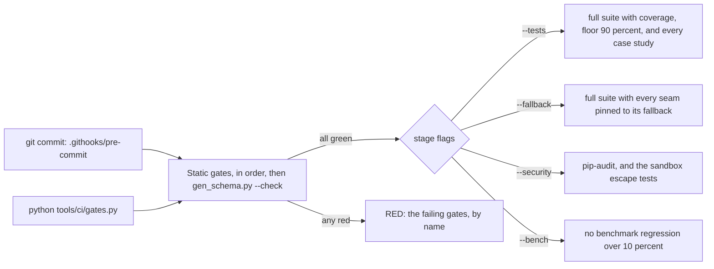

# Testing, and the gate ladder

This page is for any developer about to change MAYA: how the test suite is laid out, which fixture to reach for, how the gate ladder is run and what each gate catches, how gates are themselves tested, and how to run the part of the suite that matters for your change. The specific guides say which tests and gates move for their kind of change; this page is what they have in common. What the suite's figures were at the last full run is stated in the [repository README](../../README.md), not here, because a number copied into a second place goes stale in the second place first.

The principle behind the arrangement is that everything that can be checked mechanically is checked, and a check that has not been seen to fail has not been shown to work. So a gate comes with a test that plants a violation and asserts the gate catches it, the help is checked against the code it describes, and the API guide's examples are executed against a real server.

## When you would use what

| You are | Use |
|---|---|
| testing a service or a rule | `tests/conftest.py`: the `world` fixture, or `build_platform(...)` and `World(...)` |
| testing through the SDK as a user would | `maya.testing.Maya`, or its pytest plugin's `maya_test` and `maya_factory` |
| testing the API contract over HTTP | `tests/_contract.py`, as `tests/test_api_contract.py` does |
| testing a screen | the `env` fixtures of `tests/test_web*.py`; the browser tests need Playwright and Chrome |
| checking structure before a commit | `python tools/ci/gates.py` (the pre-commit hook runs it) |
| running everything as CI would | `python tools/ci/gates.py --tests` |

## The layout

`tests/` is flat: one `test_<area>.py` per area of the code, a few helpers beside them.

| File | What it gives you |
|---|---|
| `tests/conftest.py` | `build_platform(extra_argv)`, `World`, the module-scoped `world` fixture, `PX_DEF`, `price_csv()`, `approved_feature()` |
| `tests/_contract.py` | every endpoint from the OpenAPI document, a concrete path for it, and a minimal valid body |
| `tests/saml_idp.py`, `tests/webauthn_authenticator.py` | a test SAML identity provider and a software security key |
| `maya/testing/` | `Maya`, a throwaway in-process MAYA with seeded users and SDK clients; `market`, a shared synthetic dataset; a pytest plugin |

`build_platform` is the base of almost everything. It builds a real platform — API, permissions, workflow, lake, signer — over a temporary storage root, from the shipped `config/application.yaml` with your arguments on the command-line layer, so `build_platform(["--sources.python.wall_seconds=3"])` is how a test gets a setting. It puts the lake inside that platform's own home, because the shipped configuration points every process at one shared lake, which is what a demonstration wants and what parallel tests must not have. With `MAYA_TEST_PG_URL` set, each platform gets its own freshly created PostgreSQL database instead of SQLite.

`World` is a platform plus a principal per role:

```python
# tests/conftest.py
ROLES = {
    "dana": ["feature_designer"],
    "mick": ["feature_manager"],
    "mona": ["model_designer"],
    "devi": ["model_developer"],
    "mgr": ["model_manager"],
    "owen": ["model_owner"],
    "tess": ["techops"],
    "admin2": ["admin"],
}
```

`w.dana`, `w.mick` and so on are principals, built fresh on each access so a role change is seen; `w.admin` is the bootstrap administrator; `w.drain()` runs queued jobs inline — job workers are off in tests, so pins, validations and document generation happen exactly when the test says. The `world` fixture is one platform per module with an `eq` namespace, so tests in a module share objects and must use distinct names. A test that needs other settings, a production namespace or an isolated estate builds its own platform in a module fixture and shuts it down afterwards.

`maya.testing.Maya` is the same platform seen from outside: `maya.client("dana")` is an in-process `maya.sdk.Client` logged in as Dana, refusals raise the SDK's typed errors, and nothing reaches past the SDK unless you ask for `maya.platform`. It is a supported part of MAYA, for users testing their own pipelines as well as for MAYA's tests, and the case studies run on it.

## The gate ladder



`tools/ci/gates.py` is the single entry point, deliberately — "never a remembered list":

```python
# tools/ci/gates.py
GATES = [
    "lint.py",
    "typecheck.py",
    "file_size.py",
    "import_boundaries.py",
    "cycle_check.py",
    "module_symbols.py",
    "seam_imports.py",
    "public_symbols.py",
    "version_single_source.py",
    "no_secrets.py",
    "table_contract.py",
    "contrast.py",
    "sdk_parity.py",
    "ui_parity.py",
    "api_snapshot.py",
    "protocol_literals.py",
    "sast.py",
]
```

| Gate | Fails when |
|---|---|
| `lint.py` | ruff finds a lint fault or unformatted code in `maya`, `maya_delta`, `sdk`, `tools`, `tests`, `case_studies` |
| `typecheck.py` | `mypy --strict` finds an error in `maya/services` |
| `file_size.py` | a source file passes 1,500 non-comment lines (1,200 asks for a note, 800 warns) |
| `import_boundaries.py` | `sqlalchemy` is imported outside `maya/persistence`, application code reaches past the unit of work, or `maya/web` imports anything but the SDK |
| `cycle_check.py` | modules import each other at load time |
| `module_symbols.py` | a module exports more than 60 public names |
| `seam_imports.py` | a proxied package (`orjson`, `deltalake`, `anthropic`, …) is imported outside its seam |
| `public_symbols.py` | the SDK's public surface differs from `public_symbols.lock.json` |
| `version_single_source.py` | the version string appears outside `maya/core/version.py` (and the SDK's own `_version.py`) |
| `no_secrets.py` | `config/application.yaml` holds a secret |
| `table_contract.py` | a template emits a `<table>` not from the one table macro |
| `contrast.py` | a colour-token pair misses WCAG AA, light or dark |
| `sdk_parity.py` | an endpoint has no SDK method, or a method has no endpoint |
| `ui_parity.py` | an SDK method is reached by no web page |
| `api_snapshot.py` | the API contract differs from `openapi.lock.json` |
| `protocol_literals.py` | a test asserts a literal Delta protocol version |
| `sast.py` | bandit reports a medium or high finding not reviewed in place with `# nosec` |
| `gen_schema.py --check` | a schema file differs from the ORM metadata |

Two of these hold **locks** that are updated on purpose: `python tools/ci/api_snapshot.py --update` and `python tools/ci/public_symbols.py --update`. Run them when you meant to change the contract, and read the diff before committing it ([api-endpoints.md](api-endpoints.md)). The third generated artefact is the pair of schema files, rewritten by `python tools/ci/gen_schema.py` ([persistence-and-schema.md](persistence-and-schema.md)).

The stages run only on a green static ladder. `--tests` sets `MAYA_TEST_CASE_STUDIES=1`, so every case study runs end to end. `--fallback` reruns the suite with every Type A seam pinned to its fallback — the pure-Python lake, the stdlib JSON encoder, pandas instead of polars — through `MAYA_TEST_EXTRA_ARGV`, so each fallback is exercised by the whole suite rather than only when the preferred backend happens to be missing. `--security` needs the network for `pip-audit`.

The pre-commit hook is `.githooks/pre-commit`; enable it once with `git config core.hooksPath .githooks`. It runs the static ladder with the project's `.venv`, on the tree being committed. There is no hosted CI: the ladder runs locally, which is why the hook matters.

## How gates are tested

A gate that never fails proves nothing, so the gates are tested both ways. `tests/test_api_and_gates.py` runs each structural gate on the tree (green) and then plants a violating file and asserts the gate goes red:

```python
# tests/test_api_and_gates.py
PLANTS = {
    "import_boundaries.py": ("maya/services/_planted.py", "import sqlalchemy\n"),
    "seam_imports.py": ("maya/services/_planted.py", "import orjson\n"),
```

A planted file is named `_planted*`, and gates ignore such files unless `MAYA_CI_PLANTED=1` is set — which only the planting test sets — so another test worker running the same gate at that moment does not see the plant and fail for a reason that is not in the code (`tools/ci/_common.visible`). `tests/test_gate_ladder.py` tests the newer gates by calling their functions on constructed inputs: a synthetic import cycle, an API contract with one parameter removed.

**Adding a gate**: a script in `tools/ci/` that collects failures and returns `report(name, failures)` from `_common`; an entry in `GATES`; a green test and a planted-violation test; and, if the test plants files, an entry in `SERIAL` in `tools/ci/quick.py`.

## The documentation tests

Documentation is checked against the code wherever it can be, because help that rots quietly is worse than none:

| Test | What it holds |
|---|---|
| `tests/test_docs_links.py` | every relative link in every Markdown file in the repository resolves |
| `tests/test_help_accuracy.py` | every setting, default, REST call, SDK call, CLI command, repository path and metric the in-product help names exists; the configuration reference covers every setting |
| `tests/test_help_guides.py` | every guide renders, every help link lands on a page and an anchor, every case study has a card |
| `tests/test_api_guide.py` | the API guide's examples run against a real server; its appendix lists exactly the served endpoints |
| `tests/test_config_schema.py` | no call site invents a default the schema does not declare |

What cannot be checked mechanically — that a sentence describes behaviour correctly — is not claimed to be.

## Running a subset

```bash
.venv/bin/python -m pytest tests/test_python_source.py -q          # one area
.venv/bin/python -m pytest tests/test_features.py -k restatement -q # by name
.venv/bin/python tools/ci/quick.py                                  # everything, in parallel
.venv/bin/python tools/ci/quick.py -k pins                          # the same split, narrowed
MAYA_TEST_CASE_STUDIES=1 .venv/bin/python -m pytest tests/test_case_studies.py -n 4
MAYA_TEST_PG_URL=postgresql+psycopg://user@localhost/maya_test .venv/bin/python -m pytest -q
```

`quick.py` runs the bulk of the suite on four workers with `--dist loadfile` (module fixtures are where the cost is), the browser tests on two, and the planted-gate and whole-process tests serially, for the reasons its docstring gives. It needs `pytest-xdist`, which is not in `requirements-dev.txt`; install it into the environment first. Skips are stated rather than silent: the Keycloak tests need `MAYA_TEST_KEYCLOAK_URL`, the browser tests need Playwright and an installed Chrome, the multi-process server tests need PostgreSQL, and the strong-tier sandbox tests need bubblewrap.

## Common mistakes

- **Sharing names in a module.** The `world` fixture is module-scoped; two tests creating `eq/px` collide.
- **Expecting a job to have run.** Workers are off; call `drain()`.
- **Changing a lock to make a gate green** without reading what changed.
- **A new gate without a planted-violation test.** It has not been shown to work.
- **Testing on SQLite only** for a change near persistence. Run the affected tests with `MAYA_TEST_PG_URL`.
- **Asserting on wording you do not own.** Assert on the refusal's class and its distinctive phrase, as the existing tests do.
