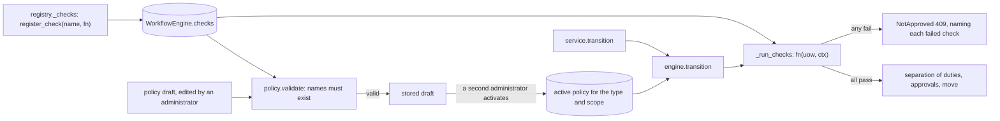
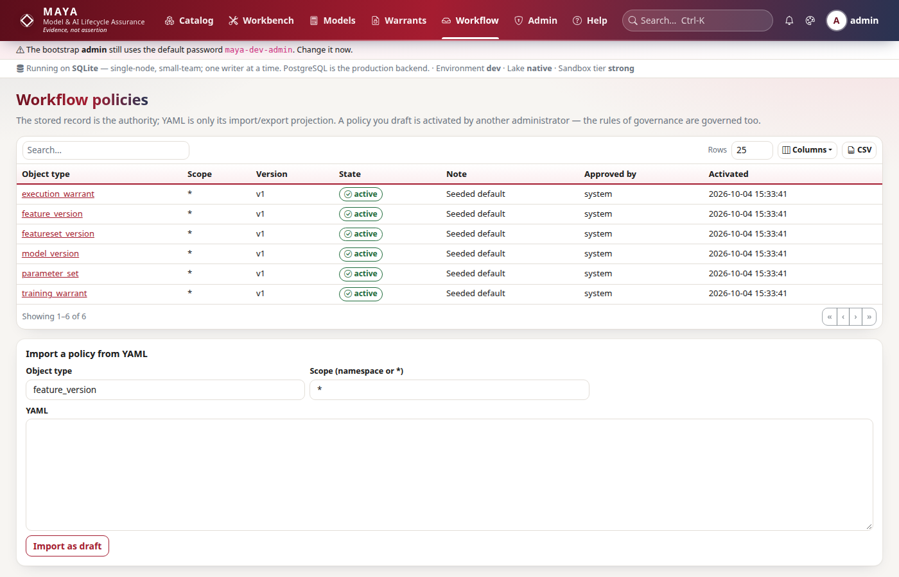

# Writing a workflow check

This page is for a developer adding a named condition that a governed object must meet before it may move — "a feature in a production namespace declares its vendor licence", "a model version names a change ticket" — and wiring it into a policy. How the engine takes a transition, in order, is in [the architecture page on workflow](../architecture/workflow.md); the policy format, the shipped policies and the existing checks are in the [workflow and policy reference](../../maya/web/guides/workflow-reference.md), which this page does not repeat.

A check is the right tool when the condition is a fact about the object that MAYA can compute, and a refusal is the right answer when it is false. It is the wrong tool for a judgement — "is this model fit for use" — which belongs to the approver, and for anything that should merely warn: a check that fails blocks.

## When you would do this, and what you touch

| File | Why |
|---|---|
| the owning service, e.g. `maya/services/features.py`, or `maya/services/registry.py` | the check function |
| `maya/services/registry.py`, `_checks` | the registration, under a name |
| a policy: **Workflow → Policies**, the API, or `maya/workflow/default_policies.yaml` | where the check is required |
| `maya/web/guides/workflow-reference.md`, "The checks" | the user-facing description of what passes |
| `tests/` | a test that the check refuses and then passes |

## How a check is reached



## The contract

A check is a function of the unit of work and a context, returning whether it passed and a sentence saying why:

```python
# maya/workflow/engine.py
CheckFn = Callable[[Any, dict[str, Any]], tuple[bool, str]]
```

The engine calls every check a transition names, and collects results rather than stopping at the first failure, so a person sees everything that blocks them at once:

```python
# maya/workflow/engine.py
        for check in t.get("checks") or []:
            fn = self.checks.get(check)
            if fn is None:
                out.append({"check": check, "passed": False, "detail": "check is not registered"})
                continue
            passed, detail = fn(uow, {"subject": subject, "row": subject.row, **subject.context})
            out.append({"check": check, "passed": bool(passed), "detail": detail})
```

What the context holds:

| Key | What it is |
|---|---|
| `subject` | the `Subject`: `object_type`, `ref`, `namespace` (the namespace row, with `production` and `sod`), `owner_id`, `owner_name`, `grants` |
| `row` | the version row as it is *before* the move: a feature version's `definition`, a model version's `formula_ir` and `artifact_report`, a warrant's `contract_report` and `leakage_certificate` |
| anything in `subject.context` | for a feature version, `feature` (the feature row); the other types add nothing today |

Four rules, each with a reason:

- **The detail is shown to the person refused.** A failed check becomes part of the refusal — `Blocked by check(s): <name> — <detail>` — and the API's problem document carries every result in `context.checks`. Write the detail so it says what to do, and write the passing detail too: every move records all its check results, passing ones included, on the object's workflow history (`workflow_events.checks`), which is what someone reconstructing the decision later reads.
- **Read, do not write.** The check runs inside the transition's transaction. A write there is committed if the move succeeds and silently lost if it does not, which is worse than either.
- **Be quick and deterministic.** Checks run on every attempt at the transition. `quality_passes` resolves a sample of data and is the slowest check MAYA has; anything slower belongs in a job whose recorded result a check reads, as `code_artifact_validated` reads the artifact report the validation job wrote.
- **Pass explicitly when the rule does not apply.** `check_artifact` returns `True, "no code artifact attached (formula-only model)"` rather than failing a model that has nothing to check, and that sentence is what a reviewer reads.

## Step by step

The worked example is `licence_declared`: a feature in a production namespace must name the vendor whose terms govern it. A tagged estate looks governed; a production feature with no licence block is one whose redistribution and derived-works terms nobody can enforce, because MAYA's licence enforcement reads them from that block.

### 1. Write the function

Checks that belong to one service are methods on it — `ModelService.check_spec`, `WarrantService.check_contract`. The two feature-version checks MAYA has are written inline in `_checks`; a feature check of your own can go either way. Here it is a plain function:

```python
# a new workflow check (example)
def licence_declared(uow: Any, ctx: dict[str, Any]) -> tuple[bool, str]:
    from maya.services import catalog

    if not ctx["subject"].namespace.get("production"):
        return True, "not a production namespace: no licence required"
    eff = catalog.effective_feature_definition(uow, ctx["row"]["definition"])
    lic = eff.get("licence") or {}
    if not lic.get("vendor"):
        return False, (
            "a feature in a production namespace declares its vendor licence "
            "(licence.vendor), so its redistribution and derived-works terms can be enforced"
        )
    return True, f"licensed from {lic['vendor']}"
```

It reads the **effective** definition, not the raw one, because a feature that `extends` another inherits its parent's licence; reading `ctx["row"]["definition"]` alone would refuse every child.

### 2. Register it

`_checks` in `maya/services/registry.py` registers every check MAYA has, by name, on the platform's engine:

```python
# maya/services/registry.py
    for name, fn in {
        "definition_valid": definition_valid,
        "quality_passes": quality_passes,
        "members_approved": lambda uow, ctx: fsets.members_approved(uow, ctx["row"]),
# ...
        "parameters_approved": execution.check_params,
    }.items():
        w.register_check(name, fn)
```

Add `"licence_declared": licence_declared` to the dictionary. Registering here, inside `wire()`, also lists the check on **Admin → Extensions** under `workflow_check`, because the plugin registry is built after the services and reads `platform.workflow.checks`. A check registered later — from a test, say — works, but is not listed.

The name is permanent in practice: stored policies refer to it by name, and the policy validator refuses to save a policy naming a check that does not exist. Renaming a check leaves every policy that uses it failing with "check is not registered".

### 3. Require it in a policy

The stored policy is the authority, not the YAML. `maya/workflow/default_policies.yaml` is seeded into the database once, for a type that has no active policy; editing the file changes new estates and does nothing to an existing one. So there are two places to wire a check, and usually you want both:

- **For new estates**, add it to the transition's `checks` in `default_policies.yaml`.
- **For an existing estate**, an administrator drafts a new policy version — on **Workflow → Policies**, by importing YAML there, or with `workflow_svc.draft_policy` — and a *different* administrator activates it. A policy may be scoped to one namespace, which is often the right first step.



Validation happens when the policy is saved, not when it bites:

```python
# maya/workflow/policy.py
    for c in t.get("checks") or []:
        if c not in checks:
            errors.append(f"transition '{name}': check '{c}' does not exist")
```

so a misspelt check name is refused at the draft, with the name, rather than blocking every object of that type on the day the policy goes live.

### 4. Describe it for users

Add a row to "The checks" in the [workflow reference](../../maya/web/guides/workflow-reference.md#the-checks): the name and, in one sentence, when it passes. That table is what an approver reads when a transition is refused, and nothing generates it.

## How to test it

Use a platform of your own when the check depends on a namespace setting: the shared `world` fixture's `eq` namespace is not production. `tests/test_workflow_and_estate.py::test_policy_is_governed_and_changes_behaviour` shows the draft-then-activate pattern, including the refusal when the author tries to activate their own draft.

```python
# a test for the check (example; World, build_platform and PX_DEF are in tests/conftest.py)
@pytest.fixture(scope="module")
def w():
    p = build_platform()
    w = World(p)
    p.access.create_namespace(w.admin, name="prod_eq", preset="standard", production=True)
    yield w
    p.shutdown()


def test_a_production_feature_without_a_licence_cannot_be_submitted(w):
    policy = copy.deepcopy(default_policies()["feature_version"])
    policy["transitions"]["submit"]["checks"].append("licence_declared")
    draft = w.p.workflow_svc.draft_policy(w.admin, "feature_version", policy, scope="prod_eq")
    w.p.workflow_svc.activate(w.admin2, draft["id"])
    w.p.features.create(w.dana, namespace="prod_eq", name="px", definition=PX_DEF)
    with pytest.raises(NotApproved, match="licence_declared"):
        w.p.features.transition(w.dana, "prod_eq/px", 1, "submit")
    w.p.features.update_draft(w.dana, "prod_eq/px", {**PX_DEF, "licence": {"vendor": "Acme Data"}})
    w.p.features.transition(w.dana, "prod_eq/px", 1, "submit")
```

`default_policies` is `maya.workflow.policy.default_policies`; `NotApproved` is in `maya.core.errors`. This test, with the check registered on the platform, was run against the code. Test the function directly as well, with a `Subject`-shaped context, for every branch — the cheap tests are the ones that pin down the detail sentences.

```bash
.venv/bin/python -m pytest tests/test_workflow_and_estate.py tests/test_workflow_matrix.py \
    tests/test_plugins.py -q
```

Which tests move when you add a check to the **shipped** policies: `tests/test_workflow_matrix.py` drives the shipped transitions by role, and any test whose objects do not satisfy the new check — across the whole suite, since every platform seeds the shipped policies — fails at that transition; give those fixtures what the check requires, rather than weakening the check. Adding a check to `default_policies.yaml` changes the schema of nothing and the API of nothing, so no lock moves.

## Common mistakes

- **Editing `default_policies.yaml` and expecting an existing estate to change.** It is seeded once.
- **Reading the raw definition** where inheritance means the effective one is what is governed.
- **A detail that only says "failed".** It is the text of the refusal.
- **Writing in a check.** Record a result in a job and have the check read it.
- **Using a check as a warning.** It blocks. Advice belongs in the assistant's challenge memo, which never blocks.
- **Trusting the protocol column on Admin → Extensions.** It says `Check.evaluate(object, ctx)`; the real signature is `fn(uow, ctx) -> (bool, str)`, as above.
