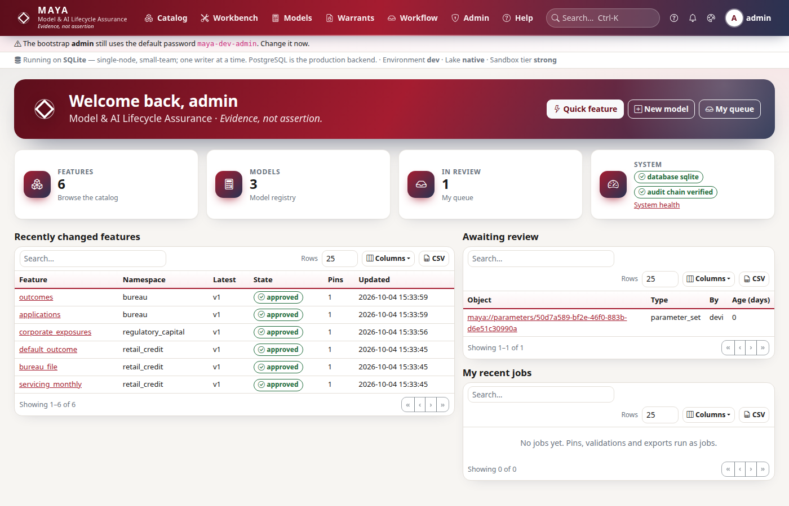

# Running MAYA in PyCharm or IntelliJ IDEA

This page sets up MAYA in a JetBrains IDE: the interpreter, the run configuration that starts
the server and the web UI, debugging, the tests, the case studies and the gates. It assumes
you have the repository on disk; the [quick start](QUICKSTART.md) covers getting Python and the
environment from the command line, and what to expect once MAYA is running.

There is one process to run. The web UI is not a separate front end: `run_maya_web.py` starts
the server, and the server serves the pages, the REST API (under `/api/v1`) and the job
workers. There is no JavaScript build — the browser libraries are vendored under
`maya/web/static/vendor/`.

## What you need

| | Version | Check |
|---|---|---|
| Python | **exactly 3.13** — the server's pinned requirements are built for it; 3.12 and 3.14 will not install them | `python3.13 --version` |
| PyCharm | Community or Professional, a current release | |
| IntelliJ IDEA | Community or Ultimate, with the Python plugin (see below) | |

Only Linux is exercised by MAYA's tests. Windows and macOS are expected to work but are not
verified; the paths below show both forms where they differ (`.venv/bin/…` on Linux and macOS,
`.venv\Scripts\…` on Windows).

## PyCharm

### 1. Open the project

**File → Open**, and choose the repository folder (the one holding `run_maya_web.py`). PyCharm
reads `pyproject.toml` and also finds `sdk/pyproject.toml`, the standalone SDK project, which it
may show as a second module (`maya-sdk`). That is expected: the SDK is its own project and the
server depends on it.

### 2. The interpreter

If you followed the quick start, `.venv` exists already. Otherwise create it: **Settings →
Project → Python Interpreter → Add Interpreter → Add Local Interpreter → Virtualenv
Environment → New**, base interpreter Python 3.13, location `<repository>/.venv`.

Then install MAYA's requirements **and the SDK project** into it, from PyCharm's terminal
(**View → Tool Windows → Terminal**):

```bash
.venv/bin/pip install -e ./sdk -r requirements.txt -r requirements-dev.txt
# Windows: .venv\Scripts\pip install -e .\sdk -r requirements.txt -r requirements-dev.txt
```

`-e ./sdk` matters: the server uses the SDK as an installed package, never a copy. Without it,
`run_maya_web.py` stops at once with *"MAYA's SDK is not installed in this environment. Run:
pip install -e ./sdk"*.

### 3. Source roots

Right-click the `sdk` folder → **Mark Directory as → Sources Root**. The program finds
`maya.sdk` through the installed package either way; this is for the editor, so that
navigation and completion resolve `import maya.sdk` to `sdk/maya/sdk/` instead of marking it
unresolved. (`maya` is a namespace package spread over the repository root and `sdk/`, and the
IDE needs to be told about the second half.)

### 4. A run configuration for the server and the UI

**Run → Edit Configurations → + → Python**:

| Field | Value |
|---|---|
| Name | `MAYA server` |
| Script path | `<repository>/run_maya_web.py` |
| Parameters | empty, or overrides such as `--server.port=8600` (any setting can be given as `--key=value`) |
| Working directory | `<repository>` |
| Python interpreter | the project's `.venv` |
| Environment variables | none needed; see below for a separate estate |

Run it. The console shows the startup lines and the addresses; open
[http://127.0.0.1:8600](http://127.0.0.1:8600). MAYA listens on every network interface
(`server.host: 0.0.0.0`), so the console also prints this machine's network address — open that
one from a phone or another computer on the same Wi-Fi (see [from your phone](#from-your-phone)). Signed out you see the landing page; **Sign in**
as `admin` with `maya-dev-admin` on a fresh estate. Stop it with the red square — the server
shuts its workers down cleanly.



By default MAYA keeps its database, blobs and lake under `data/` in the repository. To keep a
second, throwaway estate for experiments, set **both** variables in the run configuration:

```
MAYA_HOME=/tmp/maya-scratch/home
MAYA_LAKE=/tmp/maya-scratch/lake
```

### From your phone

1. Start the run configuration and read the second address in the console, for example
   `http://192.168.1.20:8600`.
2. On the phone, on the same Wi-Fi, open it.
3. Nothing loads? The firewall is blocking the port. On Ubuntu: `sudo ufw status`, and if it is
   active, `sudo ufw allow 8600/tcp`. On Windows, allow Python through Windows Defender Firewall
   for private networks when it asks.

Change the bootstrap administrator's password before you do this: anyone on the network can reach
the sign-in page. Security-key sign-in works only on `localhost` or over HTTPS, so use a password
on the phone. To keep MAYA to this machine, add `--server.host=127.0.0.1` to the parameters.

### 5. Debugging

Use **Debug** instead of **Run** on the same configuration. Breakpoints work in web routes
(`maya/web/routes/`), API routers (`maya/api/routers/`), services (`maya/services/`) and job
handlers: with the default `server.workers: 1` the pages, the API and the job workers all run
in this one process, so a breakpoint in a job handler is hit when the job runs.

Two things to know:

- `run_maya_web.py` sets Python's multiprocessing start method to `spawn` before anything
  else; start the server through this script, not by importing the application yourself.
- With `server.workers` above 1 (PostgreSQL only), the extra web processes are separate
  interpreters the debugger is not attached to. Keep the default while debugging.

### 6. Working on the UI

| You changed | To see it |
|---|---|
| a page template (`maya/web/templates/**.html`) | refresh the browser: templates are re-read when they change |
| CSS or JavaScript (`maya/web/static/css`, `static/js`) | restart the run configuration, then refresh. MAYA appends a version token to its own CSS and JS, computed when the server starts, so a browser never mixes yesterday's stylesheet with today's markup |
| Python (routes, services, anything else) | restart the run configuration |

The UI calls the SDK in process (`maya/web/routes/common.py`, `client()`), so a change in the
SDK project under `sdk/` is a Python change too: restart.

### 7. Tests

**Settings → Tools → Python Integrated Tools → Testing → Default test runner: pytest.** The
repository's `pytest.ini` is picked up (it puts the repository root and `sdk` on the path).
Then right-click `tests/` or any test file or function → **Run**.

- To run in parallel, add `-n 4` to **Additional Arguments** in the pytest run configuration
  (`pytest-xdist` is in `requirements-dev.txt`).
- The case-study tests run only with `MAYA_TEST_CASE_STUDIES=1` in the configuration's
  environment variables; they take a couple of minutes.
- Some tests that drive a real browser need Playwright's Chrome; without it they are skipped.

### 8. Case studies and the gates

Each case study is a script: a Python run configuration with **Script path**
`case_studies/01-retail-credit-pd-scorecard/run.py` (or any other study's `run.py`) and the
repository as working directory. Useful parameters: `--reset` (run this study again from
nothing), `--reset-all` (rebuild the whole demonstration estate), `--quiet`. They use the same
estate as the server, so you can watch the objects appear in the UI while the server runs.

The CI gates are `tools/ci/gates.py` — run it as a script before you commit; the commit hook
runs it too and refuses a commit that is not green.

## IntelliJ IDEA

IntelliJ IDEA runs MAYA the same way once it has the Python plugin:

1. **Settings → Plugins**: install **Python** (Ultimate) or **Python Community Edition**
   (Community), and restart.
2. **File → Open** the repository folder.
3. **File → Project Structure → Platform Settings → SDKs → + → Add Python SDK → Virtualenv
   Environment → Existing environment**, and choose `<repository>/.venv/bin/python` (create the
   environment first from the terminal as in step 2 above if it does not exist). Then
   **Project Settings → Project → SDK**: choose it.
4. **Project Structure → Modules**: on the repository module, mark `sdk` as **Sources**, and
   exclude `.venv` and `data` if they are not excluded already.
5. Install the requirements and the SDK from the IDE's terminal exactly as in PyCharm step 2.
6. **Run → Edit Configurations → + → Python** and fill it in exactly as in PyCharm step 4.

Everything else — debugging, the UI workflow, pytest, the case studies and the gates — is as
described for PyCharm; the menus are the same once the Python plugin is installed.

## When something goes wrong

| What you see | Why | What to do |
|---|---|---|
| *MAYA's SDK is not installed in this environment* | the environment lacks the `sdk/` project | `pip install -e ./sdk` into `.venv` (step 2) |
| `import maya.sdk` underlined as unresolved, but it runs | the editor does not know about `sdk/` | mark `sdk` as a Sources Root (step 3) |
| The phone cannot open MAYA | the firewall blocks port 8600, or the phone is on another network | `sudo ufw allow 8600/tcp`; check both are on the same Wi-Fi ([from your phone](#from-your-phone)) |
| *address already in use* on start (from the server binding its port) | something else holds port 8600, often another MAYA | stop it, or add `--server.port=8601` to the parameters |
| pip cannot find a version of a requirement | the environment is not Python 3.13 | delete `.venv`, recreate it from Python 3.13, reinstall |
| MAYA refuses to start over the database schema | the database was made by an older MAYA (there are no migrations) | rebuild it: [schema rebuild runbook](../operations/runbooks/schema-rebuild.md) |
| A breakpoint in a page's code is never hit | `server.workers` is above 1 | debug with the default of one web process |
| A CSS or JS change does not show | the version token is computed at start-up | restart the run configuration |
