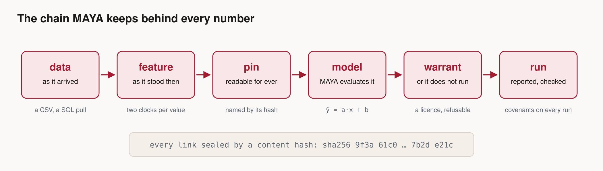
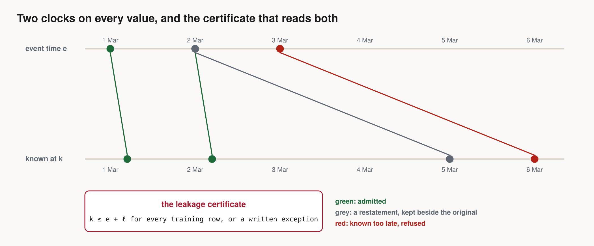
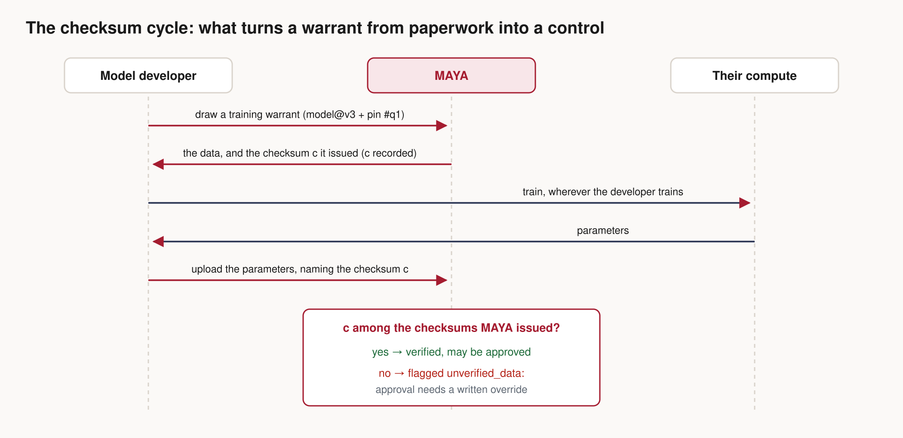
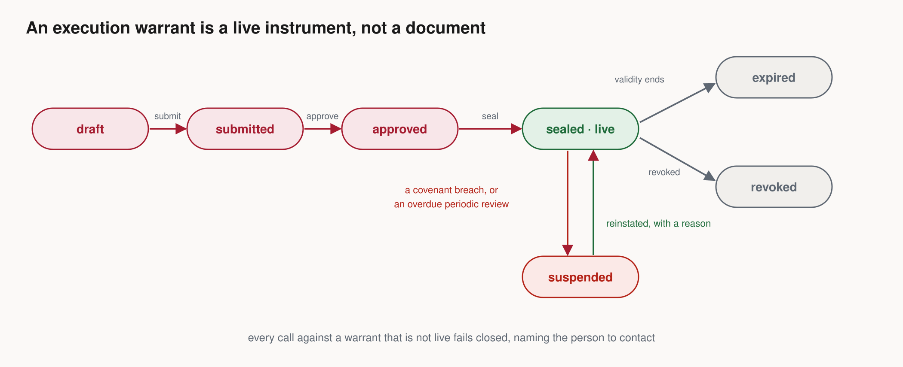
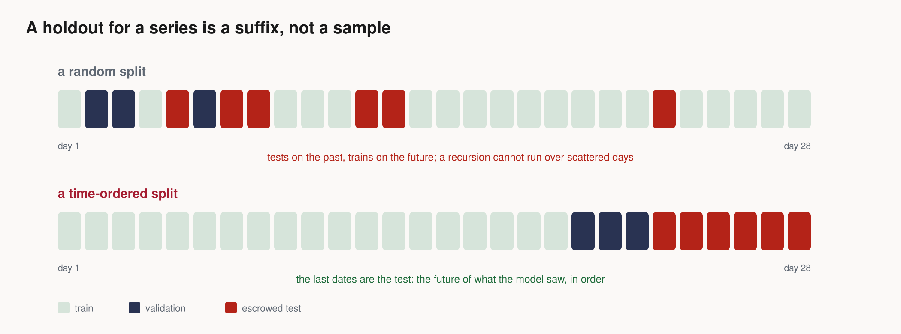
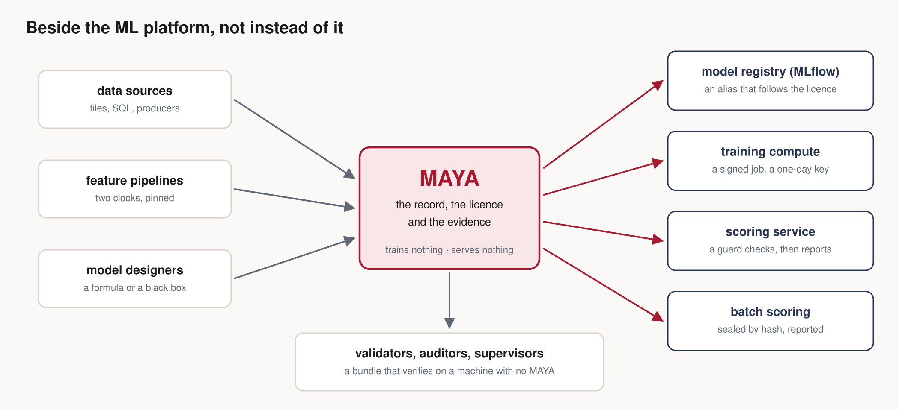

# Evidence, Not Assertion: Designing a System of Record for Models

### Ten design ideas from building MAYA, a platform that has to answer, months later, which data a model saw, which mathematics it ran and who allowed it to run

*By Ashutosh Sinha*

---

Every model that matters eventually gets asked one question. It rarely arrives on the day the
model is built. It arrives eighteen months later, from a validator, an auditor or a supervisor,
and it is always the same three questions folded into one:

> **Which data did it see, as the data stood *then*? Which mathematics, with which parameters?
> And whose approval let it run?**

Most organisations answer it from memory. A notebook named `model_final_v7.ipynb`, a spreadsheet
on somebody's laptop, a Slack thread, the quant who has since left. The answer is reconstructed,
and a reconstructed answer is an assertion.

I spent the last year building **MAYA** (Model & AI Lifecycle Assurance), a platform whose whole
job is to make that answer a matter of record rather than recollection. Its motto is *evidence,
not assertion*. This post is about the design ideas that fell out of taking that motto
literally: what had to be true of the system for the answer to be *derivable* rather than
*typed in*.



The picture above is the argument in one line. A value arrives, is read as of a moment, is
sealed by the hash of its own contents, meets the mathematics, and only then is allowed to run.
Every box is an object MAYA stores, with a version, an owner and an audit trail. The rest of this
post is about each link, and about what goes wrong when a link is a sentence in a document instead
of a fact in a system.

---

## The problem underneath: declared facts rot

Look at any model inventory and you will find fields like these:

- *Training data:* "Q1 2026 loan book"
- *Validated:* yes, 14 March
- *Inputs:* utilisation, DTI, delinquencies, bureau score
- *Status:* approved

Every one of those is **declared**: somebody typed it. And every one of them starts going stale the
moment it is saved. The loan book gets restated. The model is refitted and nobody updates
"validated". An input is renamed upstream. The status says approved while the code in production
is a different version.

The design principle that runs through everything below is simple to state:

> **If a fact can be derived from the objects themselves, derive it. Only declare what cannot be
> derived — and then say who declared it.**

The input contract is derived from the formula. A dataset's identity is derived from its contents.
What a training row could have known is derived from two timestamps. Whether a model may run is
derived from a live licence, not from a status field. The things that genuinely cannot be derived —
an approval, a judgement, an accepted risk — are recorded as acts by named people, and the system
refuses to let the same person both do and approve them.

Here are the ten ideas that make that work.

---

## 1. A model is a compute kernel and a set of dials

The first decision was what a "model" *is*, as a stored object. Not a pickle, not a Docker image:
a **compute kernel** `Y = f(X; θ)` with four faces, versioned together — its **mathematics**, its
**code**, its **parameters**, and its **specification document**.

The mathematics is written the way quants write it, and MAYA parses it into a typed tree it can
evaluate itself:

```text
d1    = (log(S/K) + (r + sigma^2/2)*T) / (sigma*sqrt(T))
d2    = d1 - sigma*sqrt(T)
price = S*ncdf(d1) - K*exp(-r*T)*ncdf(d2)
```

with a roles list saying what each name is:

```text
sigma: parameter
r: constant
```

Everything not named is a **feature** — an input that comes from data. From that alone MAYA derives
the model's input contract (`S`, `K`, `T`), renders the LaTeX back so the author can check it read
them correctly, and generates a reference implementation.

You can also write it as a Python function, which MAYA *reads* as mathematics rather than running:

```python
def pd_logit(income, utilisation, params):
    z = params["b0"] + params["b1"] * log(income) + params["b2"] * utilisation
    return 1 / (1 + exp(-z))
```

**Why this matters: the code can be checked against the mathematics.** The implementation your team
actually runs is uploaded separately, as a class with `fit(self, X, y, ctx)` and
`predict(self, X, params, ctx)`. MAYA runs it through a six-rung ladder in a sandbox — parse, the
method signatures, an import allowlist, a static ban on files, processes, network and `eval`, a
smoke run, and a determinism probe that runs it twice — and then **differentially tests it against
the formula** on sampled inputs, reporting the exact rows where they disagree.

In one of the case studies, a mortgage cashflow model carried the commonest mortgage bug there is:
`remaining = term` instead of `remaining = term - age`. It is valid, running, deterministic Python.
It agreed with the specification on **0 of 2,000** sampled inputs, and MAYA refused to approve it.

> Design idea: **make the mathematics an executable object, not a PDF.** Once it is, "does the code
> do what the document says" stops being a review meeting and becomes a test.

---

## 2. Two clocks on every value

Here is a failure mode that has sunk more backtests than any bug. A value is restated three days
after the fact — an income figure corrected, a default flag backfilled — and the restated value
quietly leaks into a training set as if it had been known at the time. The model looks brilliant in
the backtest and ordinary in production, and nobody can say why.

MAYA's answer is that **every value carries two times**: when it was true (the *event time*) and
when MAYA learned it (the *knowledge time*).



Two consequences follow, and both are enforced:

- **A restatement is a new record, never an overwrite.** The old value and the new one sit side by
  side, each with its knowledge time. Nothing is lost.
- **A read is always "as of a moment".** A feature set resolves as of an event date *and* a knowledge
  date, so a training row sees only what could have been known then.

On top of that sits the **leakage certificate**. When a training warrant is drawn, MAYA checks every
row: a value whose knowledge time falls after its event time plus a declared lag is a violation.
The certificate lists them, and the warrant cannot go forward until it is clean — or until somebody
writes down, on the record, why a late value is acceptable. (Regulatory reporting sometimes needs
exactly that: figures finalised after quarter-end by design.)

> Design idea: **point-in-time correctness belongs where the data is *used*, not only where it is
> stored.** Feature stores solve it for storage. The certificate checks it at the moment a model
> is about to learn from it.

---

## 3. Name data by what is in it

A dataset identified by a path or a version number can end up pointing at different bytes. So MAYA
identifies frozen data by its contents.

A **pin** freezes a feature's (or a feature set's) resolved data as of a date, and its identity is a
**canonical content hash** computed over the *values*, not the file. The same table written as CSV,
Parquet or Arrow hashes the same. Pin it again next year from the same inputs and you get the same
hash, byte for byte, or MAYA refuses to serve it.

References read like this:

```text
maya://feature/retail_credit/bureau_file@v3                 version 3 of the definition
maya://featureset/retail_credit/probability_of_default_panel#q1/2026-03-31
                                                           the pin "q1" as of 31 March
maya://model/retail_credit/probability_of_default_scorecard@v1
```

A feature set can only be pinned when every member is pinned; a **cascade** pins them all under one
name in one job, and rolls the whole cascade back if any member fails.

> Design idea: **make the identity of data a function of the data.** Then "is this the same data?"
> has a one-line answer, and reproducibility is a property of the system rather than a promise.

---

## 4. A licence, not a log

This is the idea I am proudest of, and the one I would steal first if I were building something
else. Most governance tools record approvals *after* the fact: an entry in a register saying a model
was approved. Nothing stops an unapproved fit or an unlicensed run. At best a report finds it later.

MAYA uses **warrants**: licences granted *in advance*, and refusable.

A **training warrant** licenses a fit before it happens: this model version, on this pin, with this
target, seed and split, against an escrowed holdout whose scoring attempts are counted. It is also
the *only* way to download training data. Which enables the control I call the **checksum cycle**:



Every download records the content hash MAYA issued. A parameter upload has to name the checksum it
was trained on — the SDK recomputes it from the table it received. A parameter set whose checksum
MAYA never issued is flagged `unverified_data` and cannot be approved without a written override.
That single check turns a warrant from paperwork into a control: you cannot quietly train on a
modified copy of the data.

In code, the whole developer loop is a few lines:

```python
import maya.sdk as maya

my = maya.connect(base_url="https://maya.example.com", api_key="maya_prod_…")

drawn = my.training.create(
    "retail_credit",
    "pd-fit-2026q1",
    "retail_credit/probability_of_default_scorecard@v1",
    "maya://featureset/retail_credit/probability_of_default_panel#q1/2026-03-31",
    spec={"target": "default_12m", "seed": 7},
)
warrant = my.warrant(drawn["id"])
with warrant.data() as ds:  # downloads, verifies, records the checksum
    train = ds.frame[ds.frame["_split"] == "train"]
    params = fit(train)  # your code, your compute
    checksum = ds.checksum
warrant.upload_parameters(params, data_checksum=checksum)
```

An **execution warrant** licenses a trained model to run: in which environments, until when, and
under which **covenants**. It is a live instrument, not a document:



Covenants are conditions checked on every reported run:

```json
[
  {"kind": "input_null_rate", "attr": "income", "max": 0.05},
  {"kind": "input_psi",       "attr": "income", "max": 0.25},
  {"kind": "output_range",    "min": 0, "max": 1}
]
```

A breach **suspends the warrant immediately**, and every subsequent call fails closed with the name
of the person to contact. A PSI covenant with no baseline gets one from the data the model was
fitted on. In the vendor-score case study, a bought credit score drifted over three months —
PSI 0.009, then 0.109, then 0.438 — and went from *live* to *suspended* without anyone reading a
single weight.

> Design idea: **replace approvals-as-records with licences-as-preconditions.** A licence can be
> refused, expire, be revoked, and suspend itself. A record can only be out of date.

---

## 5. Escrow the holdout, and score blind

If the developer can see the test set, the test set is contaminated — not maliciously, just by
iteration. So the test partition of every training warrant is **escrowed**: sealed by content hash,
never downloaded, and scored *by MAYA* when the developer asks. Every scoring attempt is counted on
the warrant, so "I tried forty parameter sets against the holdout" is visible.

This design pays off twice more.

**Black boxes.** A neural network or a bought vendor score has no formula MAYA can read. It can
still be *run*. If its code artifact has passed the ladder, MAYA runs it as an **oracle** in the
sandbox, handing it only the contract's columns of the escrowed rows and comparing its output with
the target outside the sandbox. A contract that names the target is refused before anything runs.
A black box forfeits exactly the evidence it cannot give — conformance against a formula — and no
more.

**Champion and challenger.** Two models are only comparable on the *same rows in the same order*.
Because holdouts are sealed by a hash that is sensitive to row order, **equal hashes are exactly the
licence to pair**. MAYA reports the metric difference, a seeded paired-bootstrap interval, and the
share of rows the challenger wins. In the demand-elasticity study:

| | blind RMSE (657 escrowed rows) |
|---|---|
| Linear champion | 0.2250 |
| Log-log challenger | 0.1940 |
| 95% paired interval for the difference | [−0.040, −0.022] |

The challenger wins only **60%** of rows and is still clearly better, because where it wins it wins
big — at the deepest discounts, where pricing decisions are made. Two headline numbers hide that. A
paired comparison shows it. And the challenger's own developer is refused the promotion decision.

> Design idea: **make the holdout an object the platform owns.** Blind scoring, black-box
> validation and fair comparison all become consequences of one decision.

---

## 6. A holdout for a series is a suffix, not a sample

This one I learned the hard way, by building a time-series case study (an AR(2) mean with a
GARCH(1,1) variance on daily index returns).

Every warrant's holdout used to be a hashed *sample* of rows. For independent rows, that is right.
For a time series it is wrong twice: it trains on the future and tests on the past, and it scatters
the test rows, so a model that carries state from one day to the next cannot even be run on them.
A GARCH recursion over every fifth day is not the model.



So a warrant now has a **shape**:

```python
spec = {
    "target": "ret",
    "shape": "time_series",  # earliest dates train, the last dates are the test
    "split": {"train": 0.7, "validation": 0.1, "test": 0.2},
}
```

Every test date is later than every training date, all rows of a date land in one partition (so a
panel of several series is cut at the same instant), the seed plays no part, and the escrowed rows
stay in date order. The GARCH model was then scored **blind, in the sandbox**, on the last 280 days
of each of three indices — and its fitted persistence came out at **0.9754** against a true 0.972.

That study found three places where the platform had silently assumed rows were independent: the
random split, a feature that hid the lag columns its own transforms created, and an input contract
that could not name the series key. Each is now fixed and tested.

> Design idea: **let the hardest example you can find design the system.** Fifteen case studies,
> each chosen because it makes the platform do something different, found more gaps than any
> review.

---

## 7. Beside the ML platform, not instead of it

It is tempting to make a governance platform also train and serve models. I deliberately did not.
A platform that executed the artefacts it governs would be checking its own work, and it would be
competing with tools that already do training and serving very well.

Instead MAYA goes right up to that line in five places, and stays on its own side of it:



1. **The registry alias follows the licence.** For a model imported from MLflow, a reconciler sets
   an alias (`maya-live`) on the registered version while an execution warrant for it is live, and
   removes it when none is. Your deployment follows the alias, so it follows the licence.
2. **A guard around the scoring call**, in the caller's own process:

   ```python
   from maya.sdk.guard import WarrantGuard

   guard = WarrantGuard(client, warrant_id, environment="prod")
   scores = guard.score(model.predict, batch)  # checks the licence, runs, reports the run
   ```

   It refuses against a suspended, expired or revoked warrant, and reports input statistics on the
   covenant's own bins so drift is measured on real traffic.
3. **Training dispatched to your compute.** A training warrant becomes a signed manifest, a
   Kubernetes `Job` and a SageMaker `CreateTrainingJob` request, with an API key that expires in a
   day. MAYA runs nothing; the job fits and reports back through the checksum cycle.
4. **A reference re-fit.** For a closed-form model, MAYA can fit the parameters itself on the
   training rows, as a *second route to the same answer*, recorded as evidence — never as a
   parameter set. It checks a fit; it does not supply one.
5. **Attested batch scoring.** Under a live warrant, MAYA scores a pinned table as a job: the output
   is sealed by its content hash, the run is reported so covenants are evaluated, and the pin and
   the output hash go into the warrant's custody chain.

> Design idea: **find the one thing you must own, and integrate everywhere else.** MAYA owns the
> licence and the evidence. Everything else is somebody else's job, done under that licence.

---

## 8. Judgements over derived facts

A model risk function doesn't just need facts; it makes judgements. The trick is to compute the
judgement from facts the system already holds, and to separate the person who acts from the person
who closes.

- **Materiality tiers** are derived — how many live warrants a model runs under, how often it runs,
  whether it is a black box — combined with what only the owner can declare (use, exposure, the
  firm's own questionnaire). The derivation is **monotone**: nothing you can learn that makes a model
  more consequential will move it into a lighter regime. An override that lowers the tier needs a
  reason and is flagged.
- **An overdue periodic review stops the model running.** Not a red cell on a dashboard: a scheduled
  sweep suspends every live warrant the model runs under. Recording the review lifts exactly those
  suspensions and no others.
- **Findings** have an owner, a due date and an *independent* closer. Nobody closes their own fix.
- **Monitoring** reads the reported runs as series and grades every live model *ok*, *watch* or
  *breach*. Silence is a finding: a live model that has reported nothing for thirty days is on
  *watch*.

My favourite example is fairness. The first version of MAYA's fairness check flagged a segment whose
error was well above the overall figure. Run on a unisex mortality table, it flagged *nothing*:

| | bias | MAE |
|---|---|---|
| Women | **+0.0259** (overstated) | similar |
| Men | **−0.0240** (understated) | similar |
| MAE ratio between the sexes | | **1.08** |

Both groups were wrong by the same *amount* in *opposite directions*. No check that looks only at the
size of errors can see that. The fix was a **systematic** flag — a segment whose bias is more than
half its own error — and because the law requires a unisex table, the finding was accepted rather
than fixed: by a manager, not the owner, with the legal reason written down.

> Design idea: **encode the judgement's inputs, not its conclusion.** Then the conclusion can be
> recomputed, challenged, and cannot drift from the facts.

---

## 9. Evidence that leaves the building

Evidence a vendor's platform can check only inside that platform is evidence that vouches for itself.
So a training warrant exports as a **reproducibility bundle**: a zip holding the warrant, the model
version and its IR, the generated reference implementation, the parameters, the pin's data and
manifest, the leakage certificate, and a `verify.py` that needs only Python, pyarrow and numpy.

A reviewer runs it on a laptop with no MAYA installed. It recomputes every file hash and the data's
content hash (the canonical encoder ships inside the bundle, because it *is* the definition of the
hash), and re-executes the model to compare its output hash. For a black box, where re-execution is
impossible, the bundle says so rather than implying a check it cannot perform.

> Design idea: **ship the verifier with the evidence.** Trust should not require access to the
> system that produced the claim.

---

## 10. The one exception, and why it is shaped the way it is

MAYA never deletes governed objects. An audit chain, a custody log and a lineage graph all depend on
the objects they name still existing.

But real use found a hole: a case study that failed half way left a half-built namespace in a shared
demonstration estate, and the only remedy was to wipe everything. So there is now exactly one
deletion: **purging a namespace**. Its shape is the interesting part:

- it is **refused outside a development environment** — a register people rely on does not delete what
  it governs;
- only an administrator can do it, and they must **type the name again**;
- it removes every row that belongs to the namespace — found by foreign key, by object id, and by
  reference string — and its lake folders, **in one transaction**;
- the audit log and the event stream **stay**, and the purge **records itself** in the audit log with
  what it removed.

The case studies use it as a hook: `--reset` purges only that study's namespace, and a failed run
purges its own partial work unless you ask to keep it for debugging.

> Design idea: **when you must break a rule, make the exception narrow, loud and recorded.** An
> exception that leaves no trace is a vulnerability; one that records itself is a feature.

---

## How it is built, briefly

A few engineering choices carry a lot of weight:

- **The web UI is just an SDK client.** It has no private path into the services. A gate fails the build
  if any API endpoint lacks an SDK method, or any SDK method is unreachable from the UI — 253 of each.
- **Parity is a gate, not a hope.** 18 gates run on every commit: types, import boundaries (database code
  lives in exactly one package), an API contract snapshot, contrast ratios, security analysis, schema drift.
- **No migrations.** One typed metadata generates the SQLite and the PostgreSQL schema file; a schema change
  is an estate export and reload, verified by hash.
- **Fifteen case studies, each run from nothing by the test suite.** A demonstration that has rotted is
  worse than none. Retail PD, mortgage cashflow and prepayment, HELOC exposure, Black–Scholes, IFRS 9,
  a card-fraud neural network, AR(2)–GARCH, Basel IRB capital, factor models, a Nelson–Siegel curve, a
  bought bureau score, demand elasticity, a mortality table, and an LLM complaint-triage application.
- **About 2,100 tests**, every example in the API guide executed by the suite, and a research paper whose
  every claim carries a marker naming the module and test that back it.

---

## What it doesn't do

Honesty about limits is part of the design:

- It trains and serves nothing itself. It licenses what your ML platform does.
- Linux is what is tested. The case studies have run on Windows, but it is outside the test matrix.
- Connectors to MLflow, SageMaker, OpenLineage, Snowflake and Databricks are tested against their
  published interfaces, not yet against live services.
- It has not been deployed at a supervised institution. It is one author's work, open to inspection.

---

## If you remember one thing

The question every model eventually gets asked — *which data, which mathematics, whose approval* —
has an answer only if the system that ran the model kept the answer as it went. Not in a document
beside it. In the objects themselves: data named by its contents, reads bounded by two clocks,
mathematics you can execute, and licences that exist before the fit and can say no.

That is what *evidence, not assertion* means in practice.

---

*MAYA is at [github.com/ajsinha/maya](https://github.com/ajsinha/maya). The formal account behind these
ideas — an order, an operator and a polynomial — is the research paper **Models as Parametric Kernels**,
in the repository's `docs/publications/research/`.*
