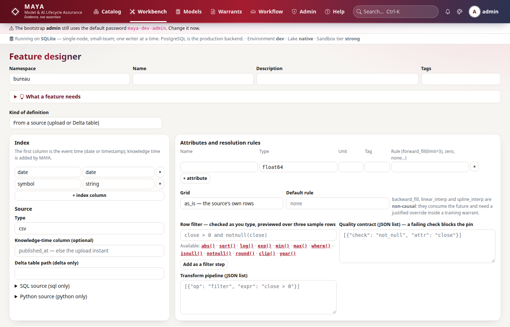
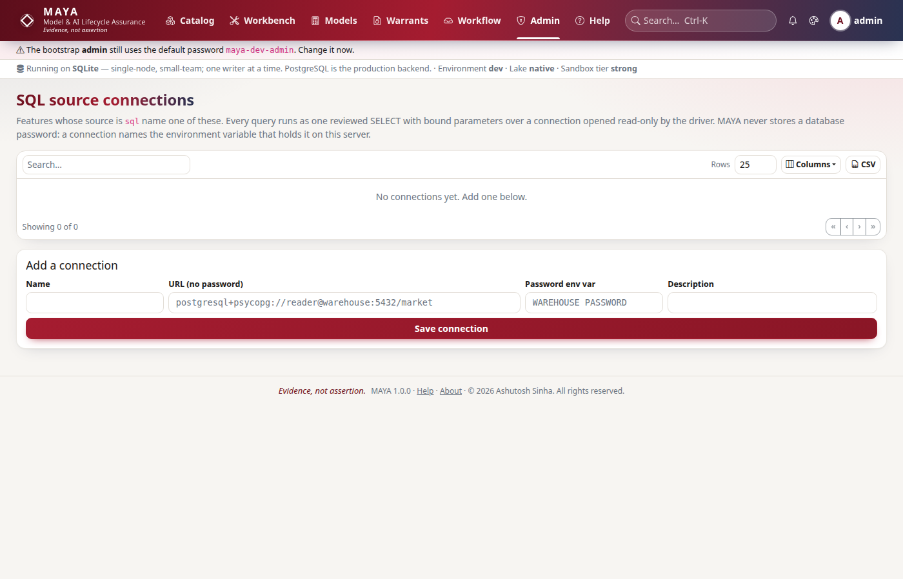
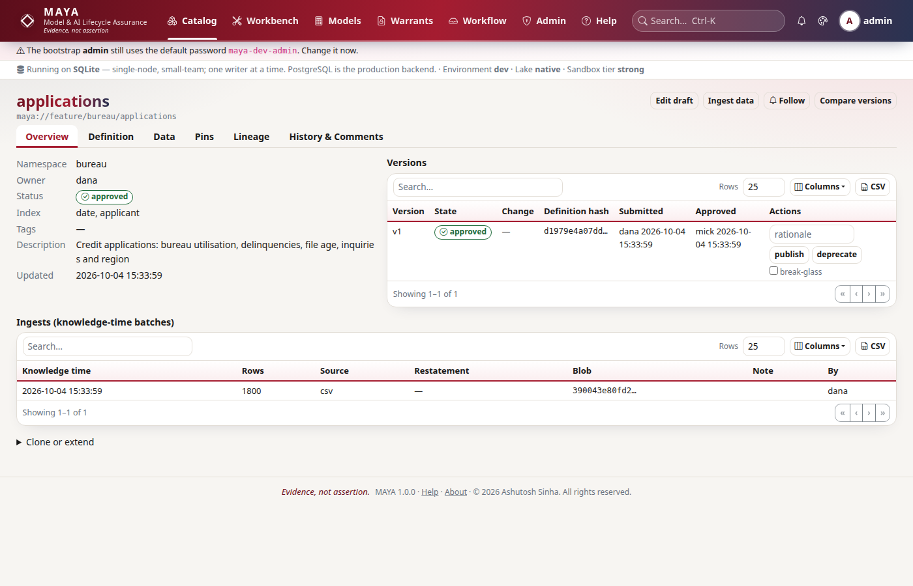

# Feature definition reference

A feature is a governed, versioned series: an index whose first column is event
time, one or more typed attributes, a source the rows come from, a resolution
policy that fills gaps, a transformation pipeline, a quality contract, and
optionally a licence. This page documents every key of a feature definition,
every value it accepts, its default, and what MAYA does with it.

The definition is JSON. You can type it in the
**Workbench → Feature designer** (`/workbench/features/new`), which builds the
same document from a form, or send it through the SDK, the CLI or the API.

## The whole definition at a glance



```json
# A complete feature definition
{
  "index": ["date", "symbol"],
  "index_types": {"date": "date", "symbol": "string"},
  "schema": [
    {"name": "close", "type": "float64", "unit": "USD"},
    {"name": "volume", "type": "int64"}
  ],
  "source": {"type": "csv", "knowledge_time_column": "published_at"},
  "resolution": {
    "grid": {"calendar": "NYSE"},
    "rules": {"close": "forward_fill(limit=3, max_age=5)", "volume": "zero"},
    "default": "none"
  },
  "transform": [
    {"op": "window", "attr": "close", "fn": "mean", "size": 20, "name": "close_ma20"}
  ],
  "quality": [
    {"check": "not_null", "attr": "close"},
    {"check": "range", "attr": "close", "min": 0, "max": 100000},
    {"check": "unique_on_index"}
  ],
  "licence": {"vendor": "Acme Data", "redistribution": "internal",
              "derived_works": "attribution"}
}
```

| Key | Required | Default | Purpose |
|---|---|---|---|
| `index` | yes (except `derived`) | — | Index columns; the first is event time |
| `index_types` | yes (except `derived`) | — | A logical type for every index column |
| `schema` | yes | — | The value attributes, at least one |
| `source` | yes | — | Where rows come from: `source.type` and its options |
| `resolution` | no | `{"grid": "as_is", "rules": {}}` | Grid and per-attribute fill rules |
| `transform` | no | `[]` | Pipeline steps applied after resolution |
| `quality` | no | `[]` | Checks run on approval and on every pin |
| `licence` | no | none | Vendor terms that travel with the data |
| `extends` | no | none | Inherit a parent version and store only the difference |

Two more fields sit beside the definition when you create a feature, not inside
it: `description` and `tags`. They are cosmetic and never change the definition
hash.

```python
# Create a feature with the SDK
import maya.sdk as maya

my = maya.connect(base_url="http://127.0.0.1:8600", api_key="maya_…")
my.features.create(
    "eq", "prices", definition, description="Daily closing prices", tags=["equity", "eod"]
)
```

## Index and event time

`index` lists the columns that identify one row. The **first column is event
time**: the date or instant the value is about. Its type must be `date` or
`timestamp`, because every read in MAYA is bitemporal and needs to know which
column carries event time. The remaining columns (a symbol, a tenor, a
counterparty) group the series; resolution rules run once per group.

`index_types` gives every index column a logical type. A column in `index`
without a type is refused.

| Rule | Error when broken |
|---|---|
| An index is declared | `an index is required: the event-time column first, e.g. (date, symbol)` |
| Every index column has a type | `index column 'symbol' has no declared type` |
| The first column is a date or timestamp | `the first index column 'symbol' is the event time and must be of type date or timestamp` |
| No name is both index and attribute | `'date' is both an index column and an attribute` |

MAYA adds `_knowledge_time` itself: never declare it. It records when each row
became known, and it is what `as_of_known` cuts on. See
[Data, pins and the lake](/help/data#reference).

## Schema: attributes and logical types

`schema` is a list of attributes. Each needs a unique `name` and a `type`.
Optional keys such as `unit` are carried with the attribute and shown in the
catalog.

```json
# Attributes with units and a monetary tag
[
  {"name": "close",  "type": "decimal(18,6)", "unit": "USD", "tag": "price"},
  {"name": "volume", "type": "int64"},
  {"name": "curve",  "type": "fixed_vector<float64,12>"}
]
```

### Scalar types

| Type | Holds | Arrow storage |
|---|---|---|
| `int32`, `int64` | whole numbers | int32, int64 |
| `float32`, `float64` | floating point | float32, float64 |
| `bool` | true or false | bool |
| `string` | text | string |
| `date` | a calendar day | date32 |
| `timestamp` | an instant, microseconds, UTC | timestamp[us, UTC] |
| `duration` | a length of time | duration |
| `decimal(p,s)` | fixed-point, precision `p`, scale `s` | decimal128 |

### Nested types

| Type | Example | Rule |
|---|---|---|
| `list<T>` | `list<float64>` | any element type |
| `fixed_vector<T,n>` | `fixed_vector<float64,12>` | `n` is a whole number ≥ 1 |
| `tensor<T,[a,b]>` | `tensor<float64,[3,4]>` | every dimension ≥ 1 |
| `struct<name:T,…>` | `struct<bid:float64,ask:float64>` | every field named and typed |
| `map<K,V>` | `map<string,float64>` | key and value are logical types |

Element types are themselves logical types, so they nest. An unknown or
malformed type is refused at definition time: `unknown logical type 'float'`
or `malformed logical type 'fixed_vector<float64,0>'`.

!!! warning "Money is decimal"
    An attribute tagged `"tag": "price"` with a float type produces the warning
    `decimal is mandatory for monetary attributes`. It does not block the submit,
    but reviewers see it.

## Sources

`source.type` says where rows come from. Every type except `derived` and
`delta` lands rows in the feature's **bitemporal ingest log**, where a later
upload for the same key appends rather than overwrites.



| `source.type` | Rows arrive by | Extra keys |
|---|---|---|
| `csv` | upload | `knowledge_time_column` |
| `parquet` | upload | `knowledge_time_column` |
| `json` | upload (a JSON array, or JSON lines) | `knowledge_time_column` |
| `sql` | pull from an administrator-managed connection | `connection`, `query`, `params` |
| `python` | pull from a sandboxed producer function | `code`, `entry`, `params` |
| `delta` | read from a Delta table at resolution | `path` |
| `derived` | an algebra operator over other features | `derivation` |

An unknown type is refused: `source.type must be one of csv, parquet, json, sql, python, delta, derived`.

### Uploads: csv, parquet and json

The upload must contain every index column and every attribute; missing columns
are named in the refusal. Extra columns are ignored. By default each batch is
stamped with the moment of ingest as its knowledge time. Two ways to give the
true publication time:

* per batch: `knowledge_time` on the ingest call (`--knowledge-time` on the CLI);
* per row: `source.knowledge_time_column` names a column of the upload.

```python
# Ingest a CSV with its real publication time
my.features.ingest(
    "eq/prices",
    open("prices.csv", "rb").read(),
    fmt="csv",
    filename="prices.csv",
    knowledge_time="2026-01-09T18:00:00Z",
)
```

```bash
# The same from the CLI
python -m maya.cli feature upload eq/prices prices.csv --knowledge-time 2026-01-09T18:00:00Z
```

`source.options` tunes parsing: `delimiter` (default `,`) and `header`
(default true) for CSV; `lines` and `record_path` for JSON. Only `csv`,
`parquet` and `json` sources take uploads, and a child that `extends` a parent
cannot: its rows are the parent's, so you ingest into the parent.

The response states the row count, the knowledge time used, whether the batch
overlaps keys already in the log (`"restatement": true`), and
`duplicate_upload_of` when the identical file was ingested before.

### sql

A SQL source names a connection an administrator created
(**Admin → Sources**, or `my.sources.create_connection`) and a query. The query
text is part of the definition, so it is hashed and reviewed.

```json
# A SQL source with a bound parameter
{"type": "sql", "connection": "vendor_db",
 "query": "SELECT date, symbol, close FROM eod WHERE region = :region",
 "params": {"region": {"type": "string", "value": "US"}}}
```

`params` maps an identifier to `{"type", "value"}`. Types are `string`, `int`,
`float`, `date` and `bool`; a bare value is a string. Rows land in the ingest
log when someone runs a pull: `my.features.pull("eq/prices")`.

### python

A Python source is a function `produce(params)` in the definition, returning
columns (`{name: [values]}`) or records (`[{name: value}]`). It runs only in the
sandbox, and the static rungs of the artifact ladder check it at definition
time: it must parse, the entry must be a module-level function taking exactly
`params`, every import must be on the allowlist (plus `datetime` and
`calendar`), and it may not touch files, processes, the network or dynamic code.

```json
# A sandboxed producer
{"type": "python", "entry": "produce",
 "code": "def produce(params):\n    return {'date': ['2026-01-05'], 'symbol': ['AAA'], 'close': [params['base']]}\n",
 "params": {"base": {"type": "float", "value": 100.0}}}
```

`entry` defaults to `produce`. Pull it exactly like SQL: `my.features.pull(ref)`.

### delta and derived

A `delta` source reads the Delta table at `source.path` whenever the feature is
resolved and stamps the rows with the current time as their knowledge time; it
has no ingest log of its own. A `derived` source applies an operator to other
features; it declares no `index` of its own because the operator's typing
supplies one. See the [Feature algebra reference](/help/algebra#reference).

## Resolution: grid and rules

Resolution runs in a fixed order every time: the knowledge-time cut, the latest
row per key, the grid, then the rules per attribute, per group, in event-time
order.

```json
# A resolution block
{"grid": {"calendar": "ISO_business_days"},
 "rules": {"close": "forward_fill(limit=3, max_age=5)"},
 "default": "none"}
```

| Key | Default | Meaning |
|---|---|---|
| `grid` | `"as_is"` | `"as_is"` keeps the dates the data has; `{"calendar": NAME}` creates a row for every calendar day, crossed with every non-date key |
| `rules` | `{}` | attribute → rule |
| `default` | none | the rule for any attribute not named in `rules` |

### Calendars

| Name | Days |
|---|---|
| `natural_days` | every day |
| `ISO_business_days` | Monday to Friday |
| `NYSE` | New York Stock Exchange trading days |
| `LSE` | London Stock Exchange trading days |
| `TARGET` | TARGET2 settlement days |

Holiday rules are computed from the year inside MAYA, so a grid built on a
calendar is reproducible evidence. The text form `"calendar:NYSE"` is accepted
too; anything else is refused with `unknown grid`.

!!! warning "A calendar grid runs to the pin date"
    When you pin with `as_of`, a calendar grid extends to that date. Days after
    your last row are filled only as far as the rule allows, and a `not_null`
    check then blocks the pin. Tutorial 1 shows this happen.

### Rules

A rule is written as text, `"forward_fill(limit=3)"` (positional arguments are
taken in the order listed below), or as a dict, `{"rule": "forward_fill", "limit": 3}`.
A missing rule is `none`.

| Rule | Parameters (minimum) | Fills a gap with | Causal |
|---|---|---|---|
| `none` | — | nothing: the value stays null | yes |
| `forward_fill` | `limit` (≥0), `max_age` (≥0 days) | the last known value | yes |
| `backward_fill` | `limit` (≥0) | the next known value | **no** |
| `linear_interp` | `limit` (≥0) | time-weighted interpolation between neighbours | **no** |
| `spline_interp` | `order` (≥1, default 3) | a spline through neighbours; needs `scipy` | **no** |
| `constant` | `v` (required) | the constant `v` | yes |
| `mean_of_window` | `n` (≥1, default 5) | the mean of the previous `n` values | yes |
| `last_known_as_of` | `lag` (≥0 days, default 0) | the last value known `lag` days before | yes |
| `zero` | — | 0 | yes |
| `previous_period` | — | the previous row's value | yes |
| `custom` | `fn` | refused: no sandboxed functions are registered in this build | — |

* `limit` is the longest run of consecutive gaps a rule fills; beyond it the
  values stay null. `max_age` stops a forward fill once the last known value is
  more than that many days old.
* Interpolation fills only inside the data (`limit_area="inside"`), never
  before the first value or after the last.
* Parameters are whole numbers. A negative `lag` would read the future and is
  refused: `rule 'last_known_as_of': lag must be a whole number of at least 0; a negative lag is look-ahead`.
* An unknown rule or parameter is refused, naming it.

!!! note "Non-causal rules"
    `backward_fill`, `linear_interp` and `spline_interp` use values from after
    the gap. The version is marked non-causal, the fill report says so, and the
    flag travels through every derivation and feature set built on it. A
    training warrant's leakage certificate is refused unless the warrant sets
    `allow_non_causal` and gives a `non_causal_justification`.

Every resolution reports what each rule did:

```json
# A fill report
{"rows": 10, "source_rows": 8, "grid": "ISO_business_days", "as_of_known": null,
 "attributes": {"close": {"rule": "forward_fill(limit=3, max_age=5)", "filled": 2,
                          "longest_run": 1, "non_causal": false}},
 "first_gap": "2026-01-07", "last_gap": "2026-01-07", "non_causal": []}
```

## Transform pipeline

`transform` is a list of steps run after resolution, each `{"op": …}`. Steps
are canonicalized before hashing, so reordering a step's keys is not a change.
Window and lag steps run per group (every index column after the first).

| Step | Keys | Result |
|---|---|---|
| `rename` | `mapping` | renames columns |
| `cast` | `attr`, `type` | casts one attribute to a logical type |
| `filter` | `expr` | keeps rows where the expression is true |
| `derive` | `name`, `expr`, optional `type` (default `float64`) | adds a computed attribute |
| `aggregate` | `by`, `agg` | groups; functions `mean`, `sum`, `min`, `max`, `std`, `first`, `last`, `count`, `median` |
| `pivot` | `index`, `columns`, `values` | wide columns named `<values>_<column value>` |
| `unpivot` | `id_vars`, `var_name`, `value_name` | long form |
| `window` | `attr`, `fn` (`mean`, `sum`, `min`, `max`, `std`), `size` (≥1), optional `name` | rolling value; default name `<attr>_<fn><size>`; partial windows allowed |
| `lag` | `attr`, `n` (≥0), optional `name` | shifted value; default name `<attr>_lag<n>` |
| `resample` | `freq` (`W` weeks ending Friday, `M` month end, `Q` quarter end), `agg` | lower-frequency rows |
| `dedupe` | `keep` (`first` or `last`, default `last`) | one row per index key |
| `clip` | `attr`, `lo`, `hi` | bounds values |
| `winsorize` | `attr`, `p` in [0, 0.5) | clips at the `p` and `1−p` quantiles of the column |

```json
# A 20-day moving average, then a derived spread
[
  {"op": "window", "attr": "close", "fn": "mean", "size": 20},
  {"op": "derive", "name": "gap", "expr": "close - close_mean20"}
]
```

### Expressions

`filter` and `derive` take an expression in MAYA's restricted language, which
is also used by feature-set filters, access-control row filters and workflow
conditions.

| Construct | Examples |
|---|---|
| Arithmetic | `+ - * / % ** //` |
| Comparisons | `< <= > >= == !=` |
| Logic | `and`, `or`, `not` |
| Membership | `symbol in ['AAA', 'BBB']`, `not in` (constant lists) |
| Conditional | `a if close > 0 else b` |
| Functions | `abs`, `sqrt`, `log`, `exp`, `min`/`max` (2–8 arguments), `where(c, a, b)`, `isnull`, `notnull`, `round(x[, n])`, `clip(x, lo, hi)`, `year`, `month`, `day` |

Attribute access, subscripts, lambdas, comprehensions and any other call are
refused by name, for example `function 'eval' is not permitted`.

## Quality contract

Checks run when a version is approved (`quality_passes`) and on every pin. A
failure blocks the pin; it never warns and seals anyway.

| Check | Keys | Passes when |
|---|---|---|
| `not_null` | `attr` | no null values |
| `unique_on_index` | — | no duplicate index keys |
| `range` | `attr`, `min`, `max` | every value within [min, max] |
| `allowed_values` | `attr`, `values` | every value in the list |
| `monotonic` | `attr`, `direction` (`increasing` default, or `decreasing`) | ordered within every group |
| `max_daily_change` | `attr`, `max` | no relative step larger than `max` |
| `row_count_between` | `min`, `max` | row count within bounds |
| `freshness_within` | `days`, optional `as_of` | the latest event is at most `days` old (on a pin, `as_of` is the pin date) |

The contract may also be written as a mapping:

```json
# The shorthand form of a quality contract
{"unique_on_index": true,
 "row_count_between": [1, 1000000],
 "attributes": {"close": {"not_null": true, "range": [0, 100000]},
                "side":  {"allowed_values": ["B", "S"]}}}
```

Each result reads like `{"check": "not_null", "attr": "close", "passed": false, "detail": "24 null value(s)"}`.

## Licence

`licence` records the vendor's terms. They combine most-restrictively through
derivations and feature sets, and every refusal names the clause and its source.

| Key | Values | Default |
|---|---|---|
| `vendor` | text, for attribution | — |
| `redistribution` | `none`, `internal`, `external`, `public` | `public` |
| `derived_works` | `forbidden`, `attribution`, `allowed` | `allowed` |
| `population` | list of groups or `desk:<name>` entries | everyone |
| `retention_days` | a whole number ≥ 1 | unlimited |
| `notes` | text | — |

Any other key is refused: `unknown licence term(s): …`. A vendor that forbids
derived works stops a derivation, an inheritance or a training warrant at the
point it is built.

## Inheritance: extends

A child definition stores only its difference from a parent version.

```json
# A child that tightens the fill rule and adds a check
{"extends": {"parent": "maya://feature/eq/prices@v3", "binding": "pinned",
             "override": {"resolution": {"rules": {"close": "forward_fill(limit=1)"}},
                          "quality": [{"check": "range", "attr": "close", "min": 1, "max": 5000}]}}}
```

| Key | Meaning |
|---|---|
| `extends.parent` | the parent reference |
| `extends.binding` | `pinned` (default): the parent must name `@vN` and that version must be approved or later; `tracking`: follows the parent, and is refused in production namespaces |
| `override.resolution` | `rules` merge over the parent's; `grid` and `default` replace |
| `override.filter` | an expression, run as a `filter` step before the parent's transforms |
| `override.transform` | steps appended to the parent's |
| `override.quality` | checks appended to the parent's |
| `override.add_attributes` | attributes appended to the schema |
| `override.drop_attributes` | attribute names removed |

The child reads the parent's ingest log, so inheritance never copies data.
`my.features.clone(ref, "prices_strict", extend=True)` starts such a child.

## Versions, hashes and change classes

Submitting a draft validates it, typechecks any derivation, computes a
**definition hash** over what determines values (index, types, schema, source,
resolution, transform, quality and the data source), classifies the change
against the previous version, and moves it to `in_review`.

| Change class | When |
|---|---|
| `breaking` | the index or index types changed, or an attribute was removed or retyped |
| `additive` | attributes were only added |
| `behavioral` | anything else that changes values: rules, grid, transforms, quality, source |

A draft that hashes identically to the previous version is refused:
`Nothing changed: this definition hashes identically to v1 (cosmetic edits do not mint a version)`.
A definition identical to another feature's is flagged for the reviewer as
`equivalent to an existing definition`.

## Before you pin: the preview

Nothing destructive without a preview (§16.4). `POST /features/{ns}/{name}/pin-preview`
resolves the version as of the date you named and reports what the pin would be, without
writing anything:

```python
p = my.catalog.pin_preview("eq/prices", version_no=3, as_of="2026-03-31", pin_name="eom")
```

| Key | What it says |
|---|---|
| `rows`, `columns` | how many rows the pin would hold, and over which columns |
| `fill_report` | which rule filled what, on the real frame |
| `checks` | the quality contract's verdict, run with the pin's own as-of — the check that would block the pin |
| `storage` | `estimated_bytes` with `bytes_per_row` measured on `sampled_rows` real rows and scaled, plus the `namespace`, the bytes it already `held_bytes`, and its `quota_bytes` |
| `blockers` | every reason the pin would be refused: an unapproved version, no pin right, a series that already has that date, a failing check, no rows, a quota it would exceed |
| `may_pin` | true only when `blockers` is empty |

The estimate is an estimate and says so: a pin writes only fragments the store has never
seen, so its own new bytes are usually smaller than the figure quoted.

In the UI the pin form's button starts disabled and is armed only by a preview that comes
back with no blockers; changing any field disarms it again.

## Following a feature

Subscribe to be told when a new version is approved or a pin that depends on the feature
is sealed (§5.7).



```python
my.catalog.subscribe("maya://feature/eq/prices")
my.catalog.subscriptions()
my.catalog.unsubscribe("maya://feature/eq/prices")
```

You may follow only what you may read. A subscription is not deleted when you lose read
access — it goes quiet, and speaks again if access returns, so a notification never
becomes a side channel around `can()`. The list marks each one `readable` so you can see
which of yours are silent. Features, feature sets and models are all subscribable; the
reference is stored bare, so a subscription follows the object rather than a version.

## References

| Reference | Addresses |
|---|---|
| `maya://feature/eq/prices` | the latest approved version (the choice is recorded) |
| `maya://feature/eq/prices@v3` | version 3, resolved live on each read |
| `maya://feature/eq/prices#eom` | the latest sealed pin in the `eom` series |
| `maya://feature/eq/prices#eom/2026-01-31` | one sealed pin |

Most SDK and CLI calls also accept the short form `eq/prices`.

## Errors you will meet

| Message | Cause | Fix |
|---|---|---|
| `The definition is not valid: …` | any rule above | the message lists every problem |
| `The upload is missing column(s): …` | an index column or attribute is absent | add the column, or fix the schema |
| `unknown resolution rule 'ffill'` | a misspelt rule | use a name from the rules table |
| `Nothing changed: …` | a cosmetic edit | change the definition, or keep the version |
| `v1 is 'draft'; only an approved version can be pinned` | pinning too early | submit and have it approved |
| `Pin blocked by the quality contract` | a check failed during the pin | read the pin's `quality` results |

Related: [Tutorial 1](/help/guides/tutorial-01-first-feature) walks through one
definition end to end, and [Data, pins and the lake](/help/data#reference)
explains what happens to the rows.
