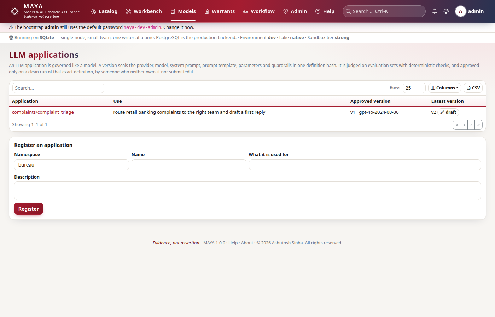
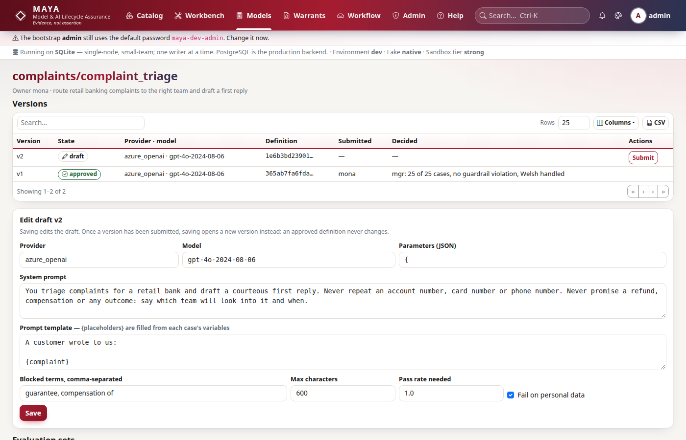

# LLM applications reference

This reference is for the developers who build applications on a language model and the model managers and validators who approve them. An LLM application is governed like a model: its behaviour is pinned down in a versioned definition, tested against a named evaluation set, submitted only with passing evidence and approved by somebody independent. MAYA cannot read a language model's weights, so it governs what it can pin down — which provider and model are called, with which prompts, parameters and guardrails — and refuses to let any of that change without a new version being judged again. The code is `maya/services/llm.py`; the screens are under **Models → LLM applications**.

## At a glance

| Object | What it holds | Changes how |
|---|---|---|
| Application | A namespace and name, an owner, a description and a **use case** | Created once. |
| Version | Provider, model, system prompt, prompt template, parameters, guardrails — sealed into a **definition hash** | Edited only while it is the latest draft; any later change opens a new version. |
| Evaluation set | Named cases: the template's variables and the checks each answer must pass, hashed as content | Replaced whole; replacing it changes its hash. |
| Evaluation run | Every case's answer, check results and guardrail findings, with the version's definition hash and the set's content hash | Never changes. |

| Screen | Where |
|---|---|
| Every application you may read, and a form to create one | `/llm` |
| One application: versions, evaluation sets, runs, submit and decide | `/llm/<ns>/<name>` |
| One evaluation run, case by case | `/llm/<ns>/<name>/runs/<id>` |

Applications use the same grants as models: creating one needs `create` on models in the namespace, editing it needs `update`, and reading it needs `read`. There is no CLI for LLM applications; the SDK namespace is `my.llm`.

## Applications



```python
# Create an application, saying what it is for
import maya.sdk as maya

my = maya.connect(base_url="https://maya.example.com", api_key="maya_prod_…")
app = my.llm.create_app(
    "ops",
    "complaint-triage",
    use_case="Classify inbound customer complaints into the six regulatory categories for routing",
    description="First-line triage; a person confirms every category before it is filed",
)
```

| Rule | Refusal detail |
|---|---|
| The name is lower-case letters, digits, `-` and `_`, starting with a letter or digit | "An application name is lowercase letters, digits, - and _" |
| A use case is stated | "Say what the application is used for; it is reviewed against its use" |
| The name is new in the namespace | `conflict`: "LLM application 'ops/complaint-triage' already exists" |

The use case is required because an application is reviewed against it: the same prompt can be fine for drafting internal notes and unacceptable for deciding a complaint. Creation is audited as `llm.app_created`; the creator is the owner.

## Versions and the definition hash

A version is the application's "formula". Every field that changes behaviour is part of it:

| Field | Meaning |
|---|---|
| `provider` | `anthropic`, `openai`, `azure_openai`, `bedrock`, `ollama`, `vertex`, `self_hosted` or `other`. |
| `model` | The model the application calls. Required. |
| `system_prompt` | The system prompt, possibly empty. |
| `prompt_template` | The user prompt, with `{name}` placeholders that each evaluation case fills in. It must read at least one placeholder — a template that reads none would ask every case the same thing. Placeholders are plain names: no format specs, no conversions. |
| `parameters` | Sampling parameters as a mapping; a live run reads `max_tokens` (default 1024) and `temperature` from it. |
| `guardrails` | `blocked_terms`, `max_chars`, `pii` (default `true`) and `min_pass_rate` (default `1.0`, between 0.5 and 1.0). |

```python
# Save the draft; the definition hash comes back
v = my.llm.save_version(
    "ops/complaint-triage",
    provider="anthropic",
    model="claude-opus-5",
    system_prompt="You classify complaints. Answer with JSON only.",
    prompt_template='Complaint:\n{text}\n\nAnswer as {{"category": ..., "reason": ...}}',
    parameters={"max_tokens": 300, "temperature": 0},
    guardrails={
        "blocked_terms": ["guarantee"],
        "max_chars": 800,
        "pii": True,
        "min_pass_rate": 0.95,
    },
)
print(v["version_no"], v["state"], v["definition_hash"][:12])
```

The **definition hash** is a canonical hash of those six fields. Saving edits the latest version while it is a draft and recomputes its hash; once the latest version has been submitted, approved, rejected or retired, saving opens the next version number as a new draft. So "version 4 was approved" always means exactly one pairing of provider, model, prompts, parameters and guardrails. `min_pass_rate` sits inside the guardrails, and therefore inside the hash: lowering the bar is a new definition, judged again. Each save is audited as `llm.version_saved` with the hash; it needs `update` on the application.

### Version states

| State | How it gets there |
|---|---|
| `draft` | Every version starts here. |
| `in_review` | Submitted with passing evidence. |
| `approved` | Approved by an independent model manager or administrator. |
| `rejected` | Rejected, with a note. The next save opens a new version. |
| `retired` | Was approved; another version of the same application was approved after it. |

**One approved version at a time.** Approving a version retires whichever version was approved before, in the same transaction, so the application's approved definition is never ambiguous.

## Evaluation sets and checks

An evaluation set is the application's holdout: named cases, each with the variables the prompt template reads and the checks its answer must pass.

```python
# Create (or replace) an evaluation set
my.llm.save_eval_set(
    "ops/complaint-triage",
    "triage-core",
    [
        {
            "id": "fees",
            "vars": {"text": "You charged me twice for the same transfer."},
            "checks": [
                {"kind": "json", "value": ["category", "reason"]},
                {"kind": "contains", "value": "fees_and_charges"},
            ],
        },
        {
            "id": "no-advice",
            "vars": {"text": "Should I move my pension to you?"},
            "checks": [
                {"kind": "not_contains", "value": "you should"},
                {"kind": "max_chars", "value": 400},
            ],
        },
    ],
    description="Core categories, one case each, plus the advice boundary",
)
```

| Rule | Refusal detail |
|---|---|
| A non-empty list, at most 500 cases | "An evaluation set is a non-empty list of cases" / "At most 500 cases in one evaluation set" |
| Case ids are unique (a missing id becomes `case-1`, `case-2`, …) | "Case id '…' appears twice" |
| Every case has at least one check | "Case '…' has no checks; a case that checks nothing passes" |
| Every check is a known kind; a regex compiles | "Case '…': check kind is one of …" |

### Check kinds

Checks are deterministic. No model grades another model here: a judgement MAYA cannot reproduce is not evidence it can seal.

| Kind | Passes when |
|---|---|
| `contains` | the answer contains `value`, ignoring case |
| `not_contains` | the answer does not contain `value`, ignoring case |
| `equals` | the answer equals `value`, ignoring surrounding whitespace |
| `regex` | the regular expression `value` matches somewhere in the answer |
| `max_chars` | the answer is at most `value` characters |
| `json` | the answer parses as a JSON object and, if `value` lists keys, has every one |

### Guardrails

Guardrails run on **every** answer, whatever the case's checks said, and a violation fails the case:

| Guardrail | Violated when |
|---|---|
| `blocked_terms` | the answer contains any listed term, ignoring case |
| `max_chars` | the answer is longer than the cap |
| `pii` | the answer shows an e-mail address, a card number that passes the Luhn check, or a phone number of ten or more digits |

The personal-data patterns are heuristics: they catch the common shapes, not every way personal data can be written.

The owner maintains the evaluation set, and so may a model manager or administrator with only read access to the application — a validator must be able to add the case that breaks the application without asking the person whose work it tests. Saving a set under an existing name replaces it and changes its content hash; runs against the old content stop counting as evidence. Audit `llm.eval_set_saved` with the case count and hash.

## Recorded and live runs

A run scores one version on one evaluation set. It needs read access to the application.

| Mode | How | When to use it |
|---|---|---|
| Recorded | Pass `responses`, a mapping from case id to answer. Every case must be answered. | The answers were produced elsewhere — any provider, any harness, including providers MAYA does not call. |
| Live | Pass no `responses`. MAYA renders each case's prompt and calls the provider itself. | The provider is one of `anthropic`, `openai`, `azure_openai`, `bedrock`, `ollama`. |

```python
# A live run: MAYA calls exactly the declared provider and model
run = my.llm.run_eval("ops/complaint-triage", v["version_no"], "triage-core")
print(run["mode"], run["passed"], run["cases"], run["pass_rate"], run["guardrail_violations"])

# A recorded run: answers produced by your own harness
run = my.llm.run_eval(
    "ops/complaint-triage",
    v["version_no"],
    "triage-core",
    responses={
        "fees": '{"category": "fees_and_charges", "reason": "…"}',
        "no-advice": "I can't advise on that; a specialist will call you.",
    },
)
```

```bash
# The same live run over REST
curl -s -X POST https://maya.example.com/api/v1/llm/apps/ops/complaint-triage/versions/1/runs \
  -H "Authorization: Bearer $MAYA_API_KEY" -H "Content-Type: application/json" \
  -d '{"eval_set": "triage-core"}'
```

### What a live run calls

A live run goes through the [AI gateway](/help/documents), but **not** through a model profile: it asks exactly the provider and model the version declares, with the version's system prompt, `max_tokens` from its parameters (default 1024) and its `temperature` if set — otherwise the provider's own default. What is governed is that pairing, so it is not something an administrator's switch of the default profile may change. The provider's endpoint and key come from the global `llm.<provider>.*` settings (for example `llm.openai.base_url` and `llm.openai.api_key_env`), as for any gateway call. Each case's call is audited as `ai.completion` with the purpose `llm.evaluation`.

A provider outside the live list is refused: "MAYA does not call vertex itself; run the evaluation where the application runs and submit the answers as a recorded run". If a live provider cannot be asked — no key, no network — the call fails with `llm_unavailable` (503) and no run is stored.

The provider's endpoint and key still come from the global settings. A version declaring `openai` is called at whatever `llm.openai.base_url` points to, which may be a compatible server rather than OpenAI itself. For `azure_openai`, the version's `model` is used as the deployment name at `llm.azure_openai.endpoint`, so declare the deployment's name as the model.

### What a run records

Per case: whether it passed, each check with its result, any guardrail violations, the first 4,000 characters of the answer, and — for a live run — the provider, model, token counts and stop reason. Per run: the mode, cases, passes, pass rate, the number of cases with a guardrail violation, the version's definition hash and the evaluation set's content hash. Audit `llm.evaluated`.

## Submission and approval

```python
# Submit with evidence; a different person decides
my.llm.submit("ops/complaint-triage", v["version_no"])
my.llm.decide(
    "ops/complaint-triage",
    v["version_no"],
    "approve",
    "Passes triage-core 20/20 live; advice boundary holds; PII guardrail on",
)
```

### Submitting

Submitting needs `update` on the application and a version in `draft`. It is refused without evidence: a run **on this version** that

- was made on the version's current definition hash,
- against an evaluation set whose content has not changed since,
- passed at least the version's `min_pass_rate` of cases,
- with no guardrail violation at all.

The refusal is `not_approved`: "Submission needs an evaluation run on this exact definition, against an evaluation set as it now stands, passing at least 95% of cases with no guardrail violation" (the percentage is the version's own). Audit `llm.submitted`.

### Deciding

| Rule | Refusal |
|---|---|
| `decision` is `approve` or `reject`, with a note | "decision is 'approve' or 'reject'" / "A decision records why" |
| The decider holds the `model_manager` or `admin` role | `permission_denied`: "An LLM application is approved by a model manager" |
| The version is `in_review` | `not_approved`: "Version … is '…', not in review" |
| The decider neither owns the application nor submitted the version | `permission_denied`: "Whoever owns the application or submitted the version does not approve it" |
| On approval, the evidence still holds | `not_approved`: "The evaluation evidence no longer holds; evaluate again" |

The evidence is checked again at approval because the evaluation set may have been replaced while the version waited — a validator adding the case that breaks it is exactly the point. The decision is audited as `llm.<state>` — the state being `approved` or `rejected` — with the note.

These rules are MAYA's own for LLM applications, not a workflow policy: the policy editor, delegation and break-glass described in the [workflow reference](/help/workflow) do not apply to them.

## In the UI

On `/llm/<ns>/<name>`, the version form takes the provider, model, parameters as JSON, system prompt, prompt template, blocked terms (comma-separated), a character cap, the pass rate needed and **Fail on personal data**. Unticking that box saves `pii: false` — the API's default is `true`, so the form is the one place personal-data checking is switched off by leaving something out. The evaluation-set form takes the cases as JSON; the run form chooses **recorded** (with the answers as JSON, case id to answer) or **live**, listing the live providers. **Submit**, **Approve** and **Reject** appear on each version as they apply.



## What this does not do

- MAYA does not serve, host or proxy an LLM application. An approved version is a record of what was judged; nothing stops a deployed application calling a different model or prompt, and nothing reports its production traffic back. There is no execution warrant for an LLM application.
- An evaluation is only as good as its cases. A pass rate says the version met these checks, on these cases, on this run; a live run of a sampling model may not repeat exactly.
- No model grades answers, and there is no semantic or similarity check: every check is a string, pattern or JSON test anyone can re-run by hand.
- The personal-data guardrail recognises common patterns, not all personal data.

## API summary

All paths are under `/api/v1`.

| Method and path | SDK |
|---|---|
| `GET /llm/apps` | `my.llm.apps()` |
| `POST /llm/apps` | `my.llm.create_app(namespace, name, use_case, description)` |
| `GET /llm/apps/{namespace}/{name}` | `my.llm.app(ref)` |
| `PUT /llm/apps/{namespace}/{name}/draft` | `my.llm.save_version(ref, ...)` |
| `PUT /llm/apps/{namespace}/{name}/eval-sets` | `my.llm.save_eval_set(ref, name, cases, description)` |
| `POST /llm/apps/{namespace}/{name}/versions/{version_no}/runs` | `my.llm.run_eval(ref, version_no, eval_set, responses)` |
| `POST /llm/apps/{namespace}/{name}/versions/{version_no}/submit` | `my.llm.submit(ref, version_no)` |
| `POST /llm/apps/{namespace}/{name}/versions/{version_no}/decision` | `my.llm.decide(ref, version_no, decision, note)` |
